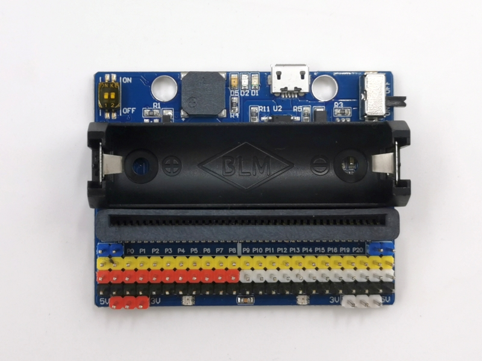
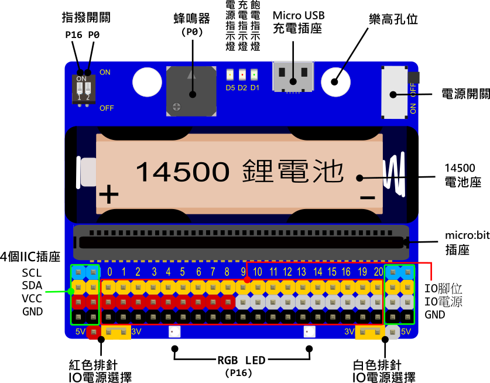
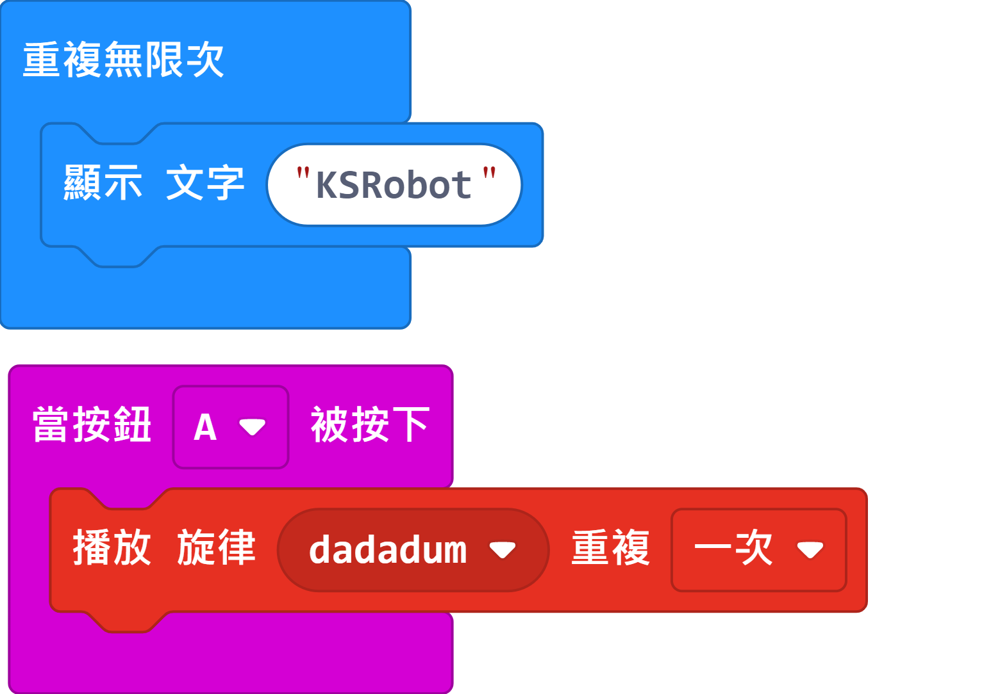
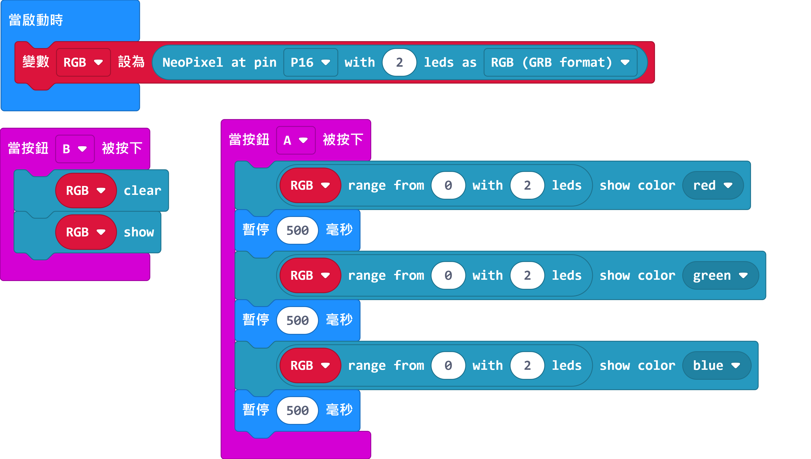
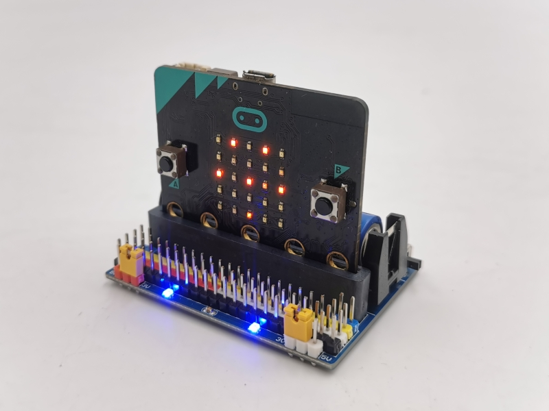
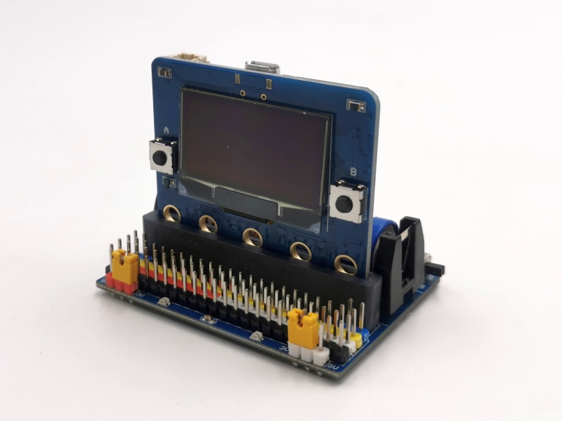
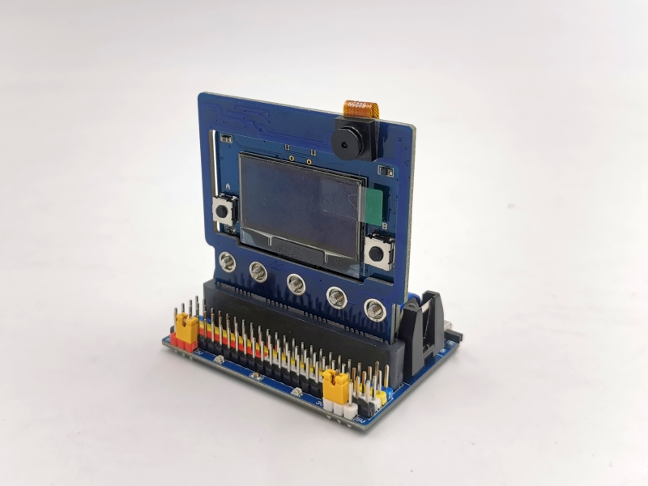

## 簡介

KSB060 IO Board 它引出了micro:bit主板的全部IO腳位，並可以使用14500鋰電池供電以達到離線應用，蜂鳴器和RGB LED可以通過指撥開關來選用。最大的特色是IO 供電 分成2組 P0~P8 和 P9~P20，這2組可以分別選用3V / 5V ，以達到不同的模組供電需求。

------

## 產品規格

- 蜂鳴器 1個

- RGB LED 2個

- 電源開關

- 5V / 3V IO電源選擇跳帽

- 指撥開關（蜂鳴器 和 RGB LED）

- 3排針IO腳位（P0~P20）

- IIC腳位插座 4個

- Micro USB 電源輸入

- 14500 電池座，可使用14500鋰電池供電

- 電源/充電/飽電 指示燈

- 樂高孔位

- 尺寸：60 x 47 x 19 mm

  

------

## 功能說明

**蜂鳴器：**板載蜂鳴器，使用P0腳位

**RGB LED**：2路全彩LED，使用P16腳位

------

## 基本範例

*範例下載：選範例後再另存連結*

#### 範例一  蜂鳴器範例

打開瀏覽器連結 https://makecode.microbit.org/

指撥開關 的P0 撥到 ON

「 匯入 」-> 「Import File」 匯入 [microbit-EX1_LED_BEEP.hex](example/KSB060/microbit-EX1_LED_BEEP.hex)

Download完成，主板LED 會秀 “KSRobot” ，按 主板 A鍵 音樂響起

####  

------

#### 範例二  RGB全彩LED範例

指撥開關 的P16 撥到 ON

「 匯入 」-> 「Import File」 匯入 [microbit-EX2_RGB_LED.hex](example/KSB060/microbit-EX2_RGB_LED.hex)

Download完成，按主板 A鍵 2 顆RGB LED 會同時出現不同顏色

按主板 B鍵 清除所有燈號

------

## 應用圖示

