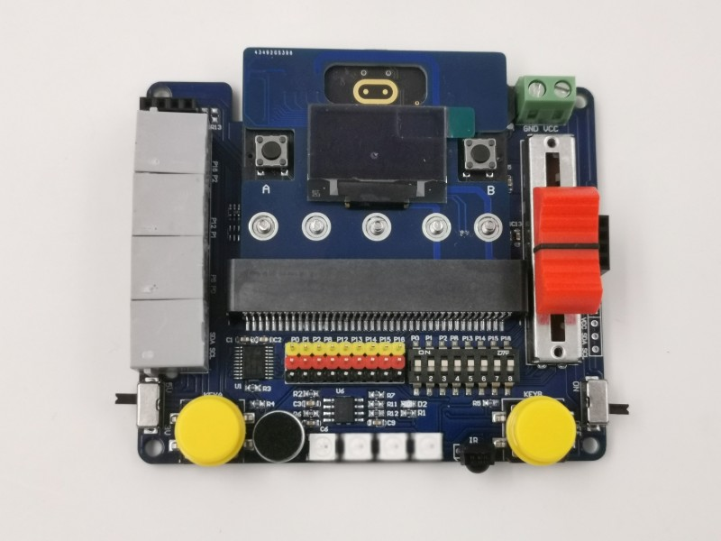

# KSB039 感測器多功能板

## 簡介

 KSB039 感測器多功能板 板載3V 5V IO電位轉換IC，讓你可以安心的使用 5V / 3V IO 的模組，
這是其它擴展板沒有的功能。

------
## 產品規格

- 蜂鳴器
- 電源開關
- 5V-3V Logic Level Converter IC
- 5V / 3V IO準位開關
- 4路RJ11插座（外接模組用）
- P0 P1 P2 P8 P12 P13 P14 P15 P16 9個3排針IO腳位
- 滑杆
- MIC 麥克風
- 4顆全彩LED
- 彩色大按鈕 2顆（KEYA， KEYB）
- IIC 孔位
- 超音波 插座
- 紅外線接收元件
- UART排母

------
## 功能說明
------
## 組裝說明
------
## 基本範例
------
## 應用圖示

