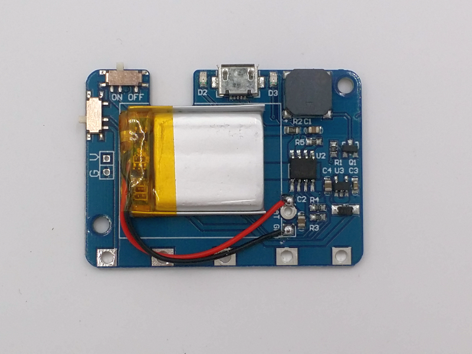
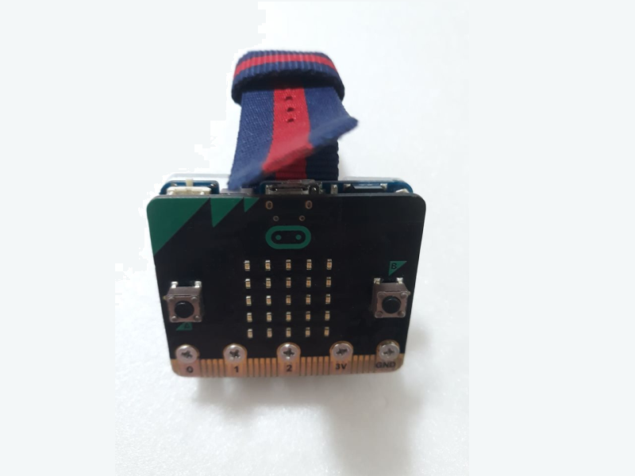
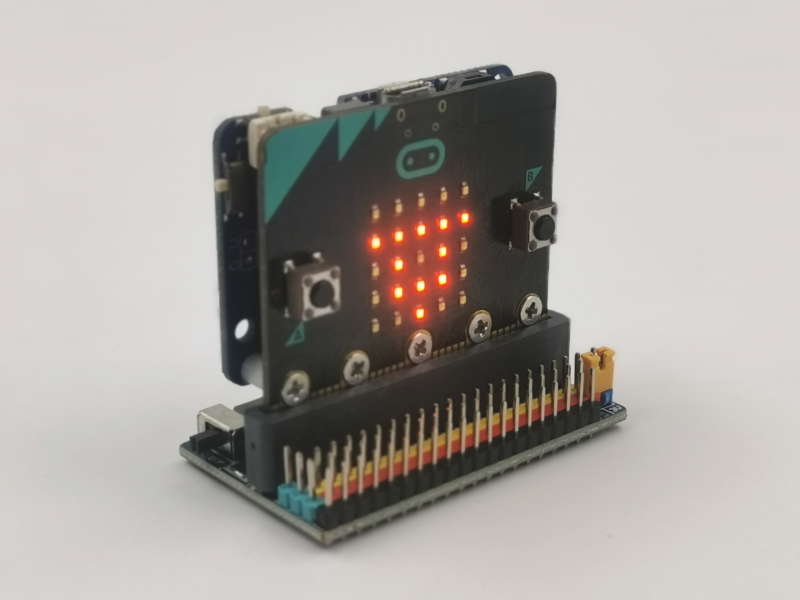
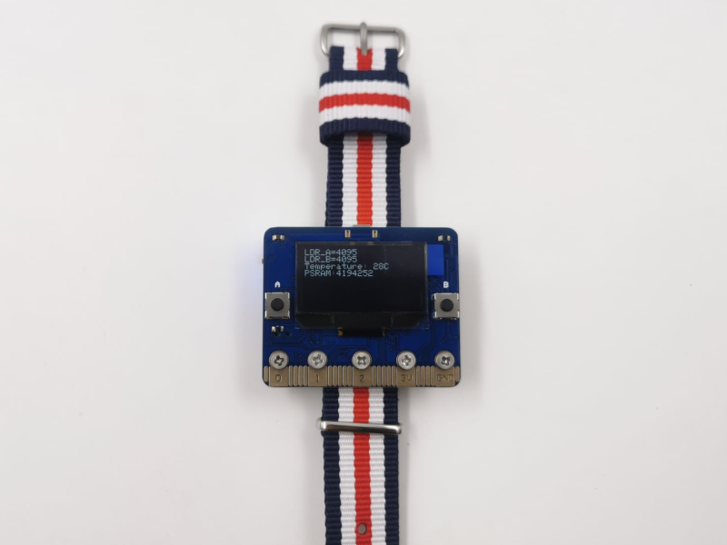

# KSB040 鋰電池板

## 簡介

KSB040 鋰電池板可輸出3.3V 500mA，不需一直更換電池響應環保，體型迷你是mciro:bit 穿載式裝置供電首選， 

------
## 產品規格

- 蜂鳴器
- 電源開關
- 蜂鳴器開關
- 內建140maH 鋰電池
- micro usb 充電

------
## 功能說明

使用USB Micro 線材插入電腦或手機充電器充電，可邊充邊用，

 

充電過程燈號顯示如下 

| 燈號                                   | 作用                                 |
| -------------------------------------- | ------------------------------------ |
| 紅燈(充電指示燈)亮，綠燈(飽電指示燈)滅 | 充電中                               |
| 紅燈滅，綠燈亮                         | 充飽電                               |
| 紅燈滅，綠燈滅                         | 鋰電池擴展板有問題，請先排除故障原因 |

**注意事項**

- 充電過程和使用過程最好不要離開視線
- 注意是否有物品會接觸主板或擴展板造成短路現象

------
## 組裝說明
<iframe width="560" height="315" src="https://www.youtube.com/embed/e2RCiFNIF9g" title="YouTube video player" frameborder="0" allow="accelerometer; autoplay; clipboard-write; encrypted-media; gyroscope; picture-in-picture" allowfullscreen></iframe>
------
## 基本範例
------
## 應用圖示

