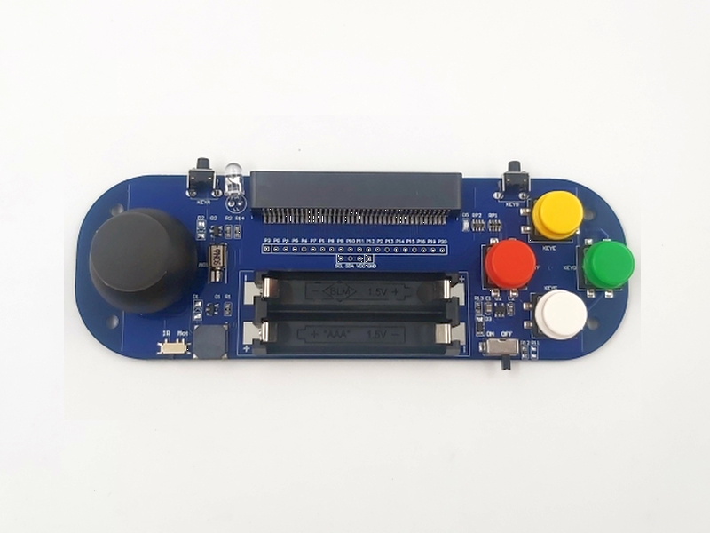
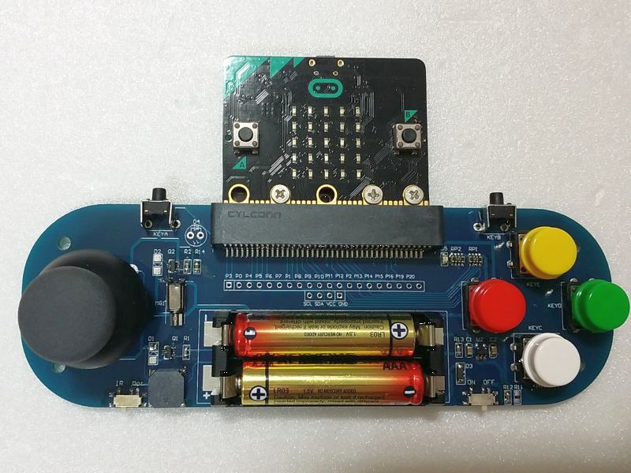
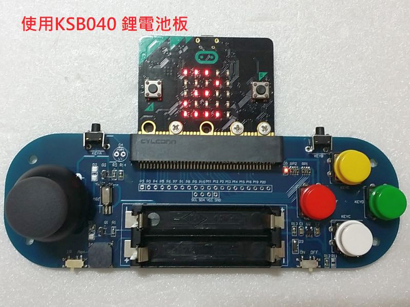

# KSB045 搖桿板

## 簡介

KSB045 搖桿板方便開發 簡易型micro:bit 手持式遊戲機，本產品最主要特色，可以搭配KSB040 鋰電池擴展板做使用，省去買電池充電的時間金錢

------
## 產品規格

- Micro:bit 插座
- 1個搖桿，兩路類比輸出，可準確定位搖桿位置，一路數位輸出，可做按鍵控制
- 4個彩色按鍵
- 2個側邊按鍵，對應micro:bit上的A/B按鍵
- 蜂鳴器，能用來播放背景音樂或遊戲音效
- 震動馬達，做遊戲時更有臨場感
- 紅外線發射器，可當做遙控器遙控小車
- 電池種類：AAA  4號1.5V電池x2 / AAA 鋰電池x2
- 尺寸：150mm x 50mm

------
## 功能說明

| 描述    | 主板腳位 | 功能       |
| ------- | -------- | ---------- |
| A       | Pin5     | 按鍵A      |
| B       | Pin11    | 按鍵B      |
| C       | Pin15    | 按鍵C      |
| D       | Pin14    | 按鍵D      |
| E       | Pin13    | 按鍵E      |
| F       | Pin12    | 按鍵F      |
| X       | Pin2     | 搖桿X方向  |
| Y       | Pin1     | 搖桿Y方向  |
| P       | Pin8     | 搖桿按下   |
| Buzzer  | Pin0     | 蜂鳴器     |
| V_Motor | P16      | 震動馬達   |
| IR_TX   | P16      | 紅外線發射 |

馬達和紅外線發射共用P16 腳位，由開關選擇使用

------
## 基本範例
------
## 應用圖示

