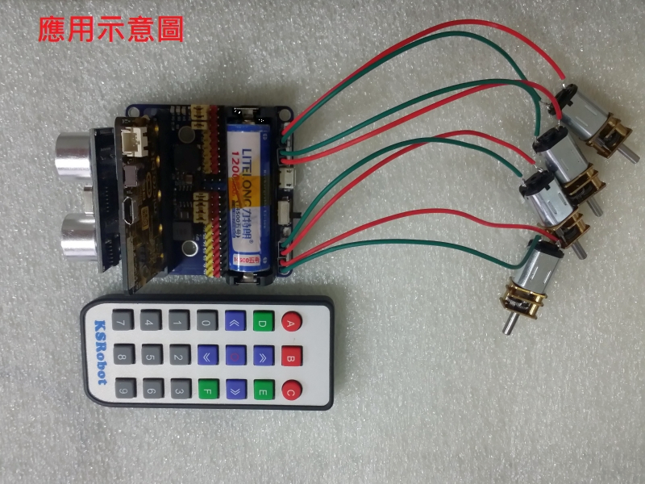

# KSB048 4路馬達舵機板

## 簡介

KSB048 4路馬達舵機板 是 多路直流馬達和多路舵機腳位，擴展板可直接充電，不需要再把鋰電池拔來拔去，一些主要IC元件，全部在正面，小朋友不容易碰到，電路有做電池防接反，防短路等可避免小朋友不小心接錯。擴充性強，留有樂高積木孔位，可用來架在積木上

------

## 產品規格

- 2路直流馬達/1路28BYJ步進馬達 和 12路舵機腳位 
- 或 4路直流馬達/2路28BYJ步進馬達 和 8路舵機腳位
- 9路IO （P0~P2 P8 P12~P16） 3PIN（GND 3V IO)排針
- 5V GND 排針
- 紅外線接收元件
- 2路全彩LED
- 蜂鳴器
- 超音波插座
- IIC腳位插座
- 14500鋰電池座
- 鋰電池充放電電路
- 電池防接反，防短路等保護電路
- PCB尺寸 6*5.8 cm

------

## 功能說明

------

## 基本範例

------

## 應用圖示

