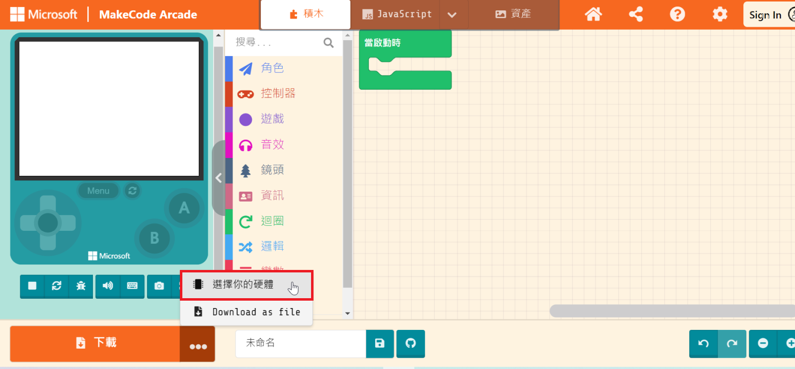
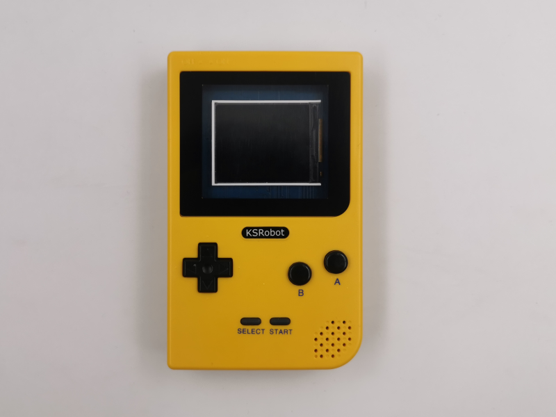

# KSB064 PlayGamer Lite 彩屏遊戲擴展板

## 簡介

 

KSB064 PlayGamer Lite 1.8" 彩屏遊戲擴展板 使用 micro:bit V2 主板 搭配微軟的MakeCode Arcade，這是一個基於網頁且對初學者友善的程式碼編輯器，與平常的MakeCode操作相同，開發者能以 積木 或是 JavaScript ，設計復古街機遊戲。 也可以單純使用micro:bit 的 MakeCode來秀出你的專題項目。 

------

## 產品規格

- 1.8吋 彩色面板

- 10個按鈕

- 電源開關

- Micro USB 電源輸入

- PH2.0 電池座，板載140maH 鋰電池

- 電源/充電/飽電 指示燈

- micro:bit Edge 腳位（P0~P20）

- 尺寸：70 x 111 x 19 mm

  

------

## 功能說明

板載鋰電池保護IC，鋰電池首次裝上時，請先插上USB線上電，否則會有不供電狀況

電源開關：僅對鋰電池和擴展板的USB供電有開關作用

電源：使用板載鋰電池供電，插USB 到擴展板的USB 可充電和供電，插USB 到主板 可下載程式和供電

充電過程燈號顯示如下 

| 燈號                                   | 作用                                 |
| -------------------------------------- | ------------------------------------ |
| 紅燈(充電指示燈)亮，綠燈(飽電指示燈)滅 | 充電中                               |
| 紅燈滅，綠燈亮                         | 充飽電                               |
| 紅燈滅，綠燈滅                         | 鋰電池擴展板有問題，請先排除故障原因 |
| 紅燈閃滅，綠燈亮                       | 鋰電池沒有插上                       |

IO 腳位： **P8 P9 P12 P13 P14 P15 P16 己被 Shift Register IC 使用，只能使用剩餘IO腳位**

按鈕：

- 上下左右 A B Menu 共7鍵，使用Shift Register IC 控制，
- Start鍵 使用P2腳位，不使用按鈕時可直接使用P2

------

## Arcade下載步驟

Makecode Arcade官方目前對micro:bit V2（nRF52833）還在測試階段，所以我們要先設定你的硬體平台。

1.新增專案 或 打開現有遊戲專案，將還在試驗版本的硬體選項開放出來

2.確認 Expermental Hardware是已啟用狀態（只需要設定一次即可）

3.返回編輯畫面

4.點擊 下載按鈕 旁的選擇硬體，在彈出的選擇硬體視窗

5.拉到最底部選擇N3

設定完成，依照一般micro:bit 下載燒錄方式，就可以將你的遊戲程式燒錄到 micro:bit  V2主板

------

## 基本範例

*範例下載：選範例後再另存連結*

#### 範例一  乒乓球遊戲範例

打開瀏覽器連結 https://arcade.makecode.com/

「 匯入 」-> 「Import File」 匯入 [arcade-pong-game.hex](example/KSB06/arcade-pong-game.hex)

Download完成，擴展板 會秀出遊戲畫面 ，按 上下左右 方向鍵 移動。

按 Menu鍵 設定聲音大小。

####  

------

#### 其它遊戲範例

- [arcade-Ocean-Platformer.hex](example/KSB06arcade-Ocean-Platformer.hex)
- [arcade-Chase-the-Pizza.hex](example/KSB06/arcade-Chase-the-Pizza.hex)
- [arcade-fish_eat_hamburger.hex](example/KSB06/arcade-fish_eat_hamburger.hex)

------

## 應用圖示

