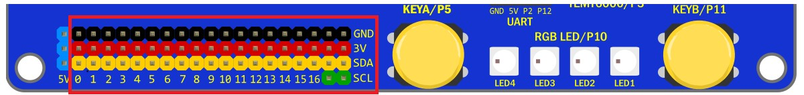

# KSB065 Home Automation Board 家庭自動化擴展板

## 簡介

KSB065 Home Automation Board 家庭自動化擴展板 簡稱 **KSB065 家控板**， 可以連接 micro:bit、PocketCard 、 NodeMCU-32S ESP32 等開發板，使用彩色TFT 螢幕且引出了全部IO腳位，並提供了多種感測器且使用14500鋰電池供電以達到離線應用。

------

## 產品規格

| KSB065 Home Automation Board       |                                                       |
| ---------------------------------- | ----------------------------------------------------- |
| Panel(全彩螢幕)                    | 1.8 TFT Panel(160x128)                                |
| TEMT6000(光度)                     | Light sensors x1                                      |
| Relay(繼電器)                      | Relay x1                                              |
| DHT11(溫濕度)                      | DHT11 x1                                              |
| Motor(馬達控制)                    | Motor x1 Channel                                      |
| Slide(滑桿)                        | Slide x1                                              |
| Buzzer(蜂鳴器 )                    | Buzzer x1                                             |
| IR(紅外接收元件)                   | IR x1                                                 |
| RGB LED(全彩燈)                    | Ws2812b x4                                            |
| Button(按鈕)                       | Programmable buttons x2                               |
| micro SD Socket(micro SD插座)      | micro SD Socke x1                                     |
| Switch(指撥開關)                   | 8 bit  Switch x4                                      |
| PSRAM(虛擬靜態隨機存取記憶體)      | PSRAM 8192 KB  for ESP32                              |
| micro USB Socket(micro USB插座)    | For charging and power supply（充電和供電用）         |
| 14500 Battery Socket(14500 電池座) | 14500 Battery Socke x1                                |
| IO interface(排針插座)             | P0~P16(SVG)，IIC Socket x2，UART Socket，Sonar Socket |
| Lego positioning hole(樂高孔位)    | Lego positioning hole                                 |
| Size                               | 13.6x10.4cm                                           |

## 感測器IO 對應表格

NodeMCU-32S 和 PocketCard ESP32 使用的感測器腳位一樣

| Sensor 感測器 | micro:bit IO  | ESP32 IO |
| ---------------| --------------|----------|
| Buzzer(蜂鳴器 )	|P0|IO26|
| Slide(滑桿)      | P1 | IO33 |
| IR(紅外接收元件) | P3           | IO35       |
| TEMT6000(光度)   | P4     | IO4  |
| ButtonA(按鈕A)   | P5        	| IO14       |
| Motor(馬達控制)  | P6        		| IO16 |
| Motor(馬達控制)  | P1	| IO33 |
| Relay(繼電器)    | P7           | IO17       |
| DHT11(溫濕度)    |P9|IO13|
| RGB LED(全彩燈)	|P10|IO2|
| ButtonB(按鈕B) |P11|IO25|
| UART Rx|P2|IO32|
| UART Tx|P12|IO15|
| Sonar(超音波插座) |P14|IO19|
| ST7735彩屏(SCK) |P13|IO18|
| ST7735彩屏(MOSI) |P15|IO23|
| ST7735彩屏(DC) |P8|IO27|
| ST7735彩屏(CS) |P16|IO5|
| ST7735彩屏(RST) |3V|3V|
| SD(SCK) |P13|IO18|
| SD(MOSI) |P15|IO23|
| SD(MISO) |P14|IO19|
| SD(CS) |P4|IO4|
| PSRAM(CS) |P6|IO16|
| PSRAM(SCK) |P7|IO17|

**PS**

Motor(馬達控制)  和 Slide(滑桿)  的 IO腳位P1重複，功能2擇1

Motor(馬達控制)  和  PSRAM 的 IO腳位P6重複，功能2擇1

Relay(繼電器)   和 PSRAM 的 IO腳位P7重複，功能2擇1

TEMT6000(光度) 和 SD 的 IO腳位P4重複，功能2擇1

Sonar(超音波插座) 和 SD 的 IO腳位P14重複，功能2擇1

## 排針腳位 對應表格

NodeMCU-32S 和 PocketCard ESP32 對應排針腳位一樣

**PS**：全部IO 都已經被板子上的感測器使用完畢，要用排針腳位另接模組，需用**指撥開關**關掉相對應的感測器IO

| PCB標示 | micro:bit | ESP32 | 備註                          |
| ------- | --------- | ----- | ----------------------------- |
| 0       | P0        | IO26  | 蜂鳴器                        |
| 1       | P1        | IO33  | 滑桿 或 馬達控制              |
| 2       | P2        | IO32  | UART 插座Rx                   |
| 3       | P3        | IO35  | 紅外接收元件                  |
| 4       | P4        | IO4   | 光度感測器 或 SD(CS)          |
| 5       | P5        | IO14  | 按鈕A                         |
| 6       | P6        | IO16  | 馬達控制                      |
| 7       | P7        | IO17  | 繼電器                        |
| 8       | P8        | IO27  | ST7735彩屏(DC)                |
| 9       | P9        | IO13  | DHT11                         |
| 10      | P10       | IO2   | 全彩燈                        |
| 11      | P11       | IO25  | 按鈕B用                       |
| 12      | P12       | IO15  | UART 插座Tx                   |
| 13      | P13       | IO18  | ST7735彩屏(SCK) 和 SD(SCK)    |
| 14      | P14       | IO19  | SD(MISO) 或 Sonar(超音波插座) |
| 15      | P15       | IO23  | ST7735彩屏(MOSI) 和 SD(MOSI)  |
| 16      | P16       | IO5   | ST7735彩屏(CS)                |
| SCL     | P19       | IO22  | IIC用                         |
| SDA     | P20       | IO21  | IIC用                         |

## 指撥開關腳位 對應表格

指撥開關往ON 的方向撥是 打開/ON，往下撥是 關閉/OFF

| 
指撥開關1 標示
 | 
感測器
 |
micro:bit
 | 
PocketCard
 |
| ------------ | ------------------ |--------- | ----- |
| 1            | 蜂鳴器               |P0       | IO26  |
| 2            | 滑桿      |P1        | IO33  |
| 3            | UART 插座Rx         |P2        | IO32  |
| 4            | ST7735彩屏(DC)      |P8        | IO27  |
| 5            | UART 插座Tx         			|P12       | IO15  |
| 6            | ST7735彩屏(SCK) 和 SD(SCK) |P13       | IO18  |
| 7            | ST7735彩屏(MOSI) 和 SD(MOSI) |P15       | IO23  |
| 8            | ST7735彩屏(CS)               |P16       | IO5  |

如果需要使用micro:bit 5x5 LED屏，需要關閉 對應感測器的功能，指撥開關2 全部往下撥到OFF，

| 
指撥開關2 標示
 | 
感測器 
|
micro:bit
 |
 PocketCard
 |
| ------------ | ------------------ |--------- | ----- |
| 1            | 馬達控制      |P1       | IO33 |
| 2            | 光度感測器 | P4        | IO4   |
| 3            | 紅外接收元件   | P3        | IO35  |
| 4            | 繼電器   | P7        | IO17  |
| 5            | DHT11    | P9        | IO13  |
| 6            | 全彩燈 | P10       | IO2   |
| 7            | 馬達控制 | P6        | IO16  |
| 8            | SD(CS)    | P4       | IO4 |

指撥開關3和指撥開關4 是NodeMCU-32S 專用指撥開關，是用來連接 NodeMCU-32S 和感測器的腳位，

使用micro:bit 和PocketCard 不用理會。

|
 指撥開關3 標示 
 | 
感測器
  | 
NodeMCU-32S  
|
| ------------ | ------------------ | ----- |
| 1            | 蜂鳴器                       | IO26    |
| 2            | 滑桿 或 馬達控制                |  IO33    |
| 3            | UART 插座Rx                  |  IO32    |
| 4            | ST7735彩屏(DC)               |  IO27    |
| 5            | UART 插座Tx                  |  IO15    |
| 6            | ST7735彩屏(SCK) 和 SD(SCK)   |  IO18    |
| 7            | ST7735彩屏(MOSI) 和 SD(MOSI) |  IO23    |
| 8            | ST7735彩屏(CS)               | IO5  |

|
 指撥開關4 標示 
 | 
感測器
  | 
NodeMCU-32S  
|
| ------------ | ------------------ | ----- |
| 1            |           |      |
| 2            | SD(CS) 或 光度感測器 |  IO4     |
| 3            | 紅外接收元件   |  IO35    |
| 4            | 繼電器        |  IO17    |
| 5            | DHT11        |  IO13    |
| 6            | 全彩燈        |  IO2     |
| 7            | 馬達控制      |  IO16    |
| 8            | SD(MISO) 或 超音波 | IO19 |

------

## 功能說明

**板載鋰電池保護IC，鋰電池首次裝上時，請先插上USB線上電，否則會有不供電狀況**

電源開關：僅對鋰電池和擴展板的USB供電有開關作用

電源：使用板載鋰電池供電，插USB線 到擴展板的USB座 可充電和供電

充電過程燈號顯示如下 

| 燈號           | 作用                                 |
| -------------- | ------------------------------------ |
| 紅燈(充電指示燈)亮，綠燈(飽電指示燈)滅 | 充電中                               |
| 紅燈滅，綠燈亮 | 充飽電                               |
| 紅燈滅，綠燈滅 | 鋰電池擴展板有問題，請先排除故障原因 |
| 紅燈閃滅，綠燈亮 | 鋰電池沒有插上 |

------

## 基本範例

------

## 應用圖示

