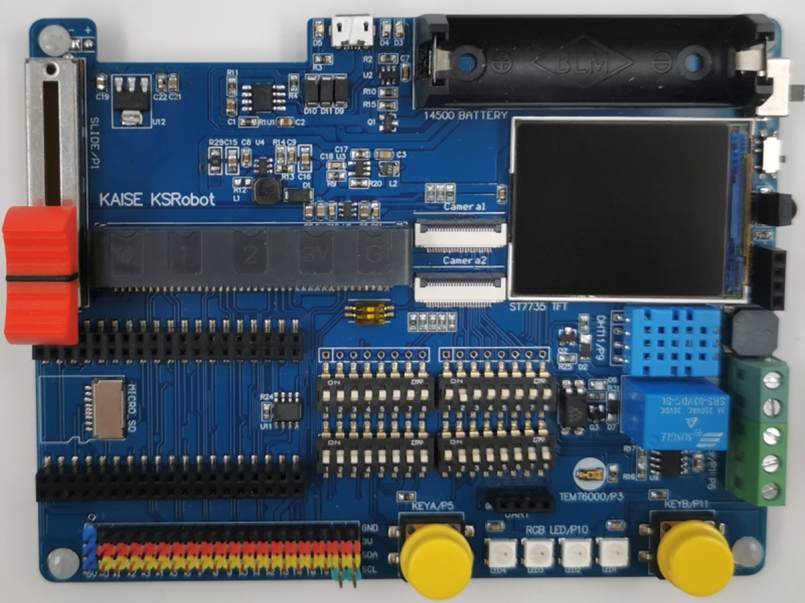
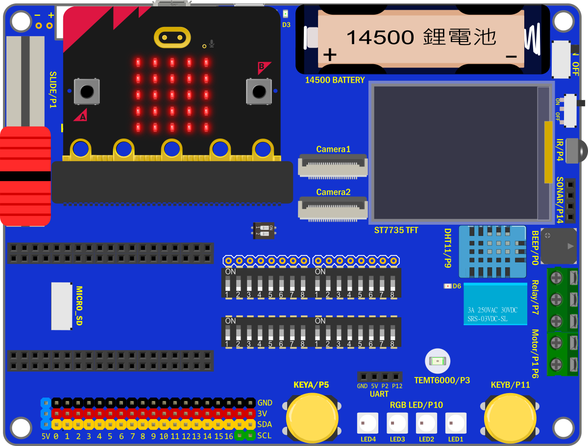
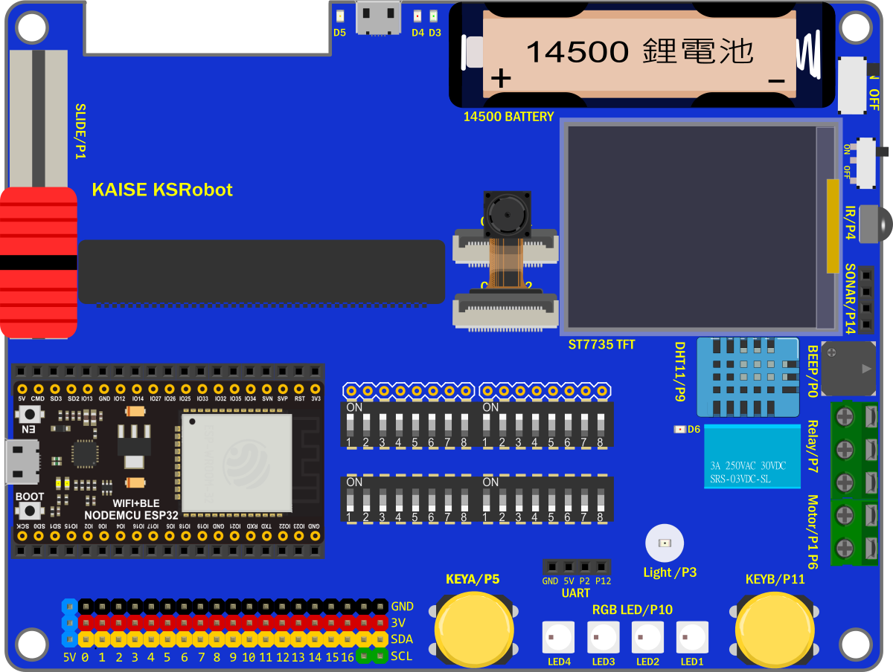
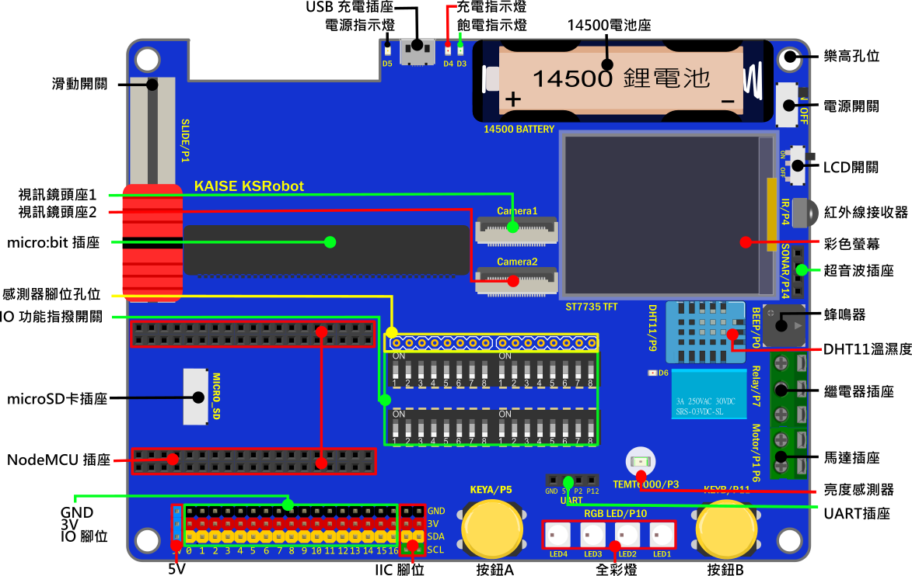

# KSB065 Home Automation Board 家庭自動化擴展板

## 簡介

KSB065 Home Automation Board 家庭自動化擴展板 簡稱 **KSB065 家控板**， 可以連接 micro:bit、PocketCard 、 NodeMCU-32S ESP32 等開發板，使用彩色TFT 螢幕且引出了全部IO腳位，並提供了多種感測器且使用14500鋰電池供電以達到離線應用。

------

## 產品規格

| KSB065 Home Automation Board       |                                                       |
| ---------------------------------- | ----------------------------------------------------- |
| Panel(全彩螢幕)                    | 1.8 TFT Panel(160x128)                                |
| TEMT6000(光度)                     | Light sensors x1                                      |
| Relay(繼電器)                      | Relay x1                                              |
| DHT11(溫濕度)                      | DHT11 x1                                              |
| Motor(馬達控制)                    | Motor x1 Channel                                      |
| Slide(滑桿)                        | Slide x1                                              |
| Buzzer(蜂鳴器 )                    | Buzzer x1                                             |
| IR(紅外接收元件)                   | IR x1                                                 |
| RGB LED(全彩燈)                    | Ws2812b x4                                            |
| Button(按鈕)                       | Programmable buttons x2                               |
| micro SD Socket(micro SD插座)      | micro SD Socke x1                                     |
| Switch(指撥開關)                   | 8 bit  Switch x4                                      |
| PSRAM(虛擬靜態隨機存取記憶體)      | PSRAM 8192 KB  for ESP32                              |
| micro USB Socket(micro USB插座)    | For charging and power supply（充電和供電用）         |
| 14500 Battery Socket(14500 電池座) | 14500 Battery Socke x1                                |
| IO interface(排針插座)             | P0~P16(SVG)，IIC Socket x2，UART Socket，Sonar Socket |
| Lego positioning hole(樂高孔位)    | Lego positioning hole                                 |
| Size                               | 13.6x10.4cm                                           |

------

## 功能說明

**板載鋰電池保護IC，鋰電池首次裝上時，請先插上USB線上電，否則會有不供電狀況**

電源開關：僅對鋰電池和擴展板的USB供電有開關作用

電源：使用板載鋰電池供電，插USB線 到擴展板的USB座 可充電和供電

充電過程燈號顯示如下 

| 燈號           | 作用                                 |
| -------------- | ------------------------------------ |
| 紅燈(充電指示燈)亮，綠燈(飽電指示燈)滅 | 充電中                               |
| 紅燈滅，綠燈亮 | 充飽電                               |
| 紅燈滅，綠燈滅 | 鋰電池擴展板有問題，請先排除故障原因 |
| 紅燈閃滅，綠燈亮 | 鋰電池沒有插上 |

------

## 感測器IO 對應表格

NodeMCU-32S 和 PocketCard ESP32 使用的感測器腳位一樣

| Sensor 感測器 | micro:bit IO  | ESP32 IO |
| ---------------| --------------|----------|
| Buzzer(蜂鳴器 )	|P0|IO26|
| Slide(滑桿)      | P1 | IO33 |
| IR(紅外接收元件) | P3           | IO35       |
| TEMT6000(光度)   | P4     | IO4  |
| ButtonA(按鈕A)   | P5        	| IO14       |
| Motor(馬達控制)  | P6        		| IO16 |
| Motor(馬達控制)  | P1	| IO33 |
| Relay(繼電器)    | P7           | IO17       |
| DHT11(溫濕度)    |P9|IO13|
| RGB LED(全彩燈)	|P10|IO2|
| ButtonB(按鈕B) |P11|IO25|
| UART Rx|P2|IO32|
| UART Tx|P12|IO15|
| Sonar(超音波插座) |P14|IO19|
| ST7735彩屏(SCK) |P13|IO18|
| ST7735彩屏(MOSI) |P15|IO23|
| ST7735彩屏(DC) |P8|IO27|
| ST7735彩屏(CS) |P16|IO5|
| ST7735彩屏(RST) |3V|3V|
| SD(SCK) |P13|IO18|
| SD(MOSI) |P15|IO23|
| SD(MISO) |P14|IO19|
| SD(CS) |P4|IO4|
| PSRAM(CS) |P6|IO16|
| PSRAM(SCK) |P7|IO17|

**PS**

Motor(馬達控制)  和 Slide(滑桿)  的 IO腳位P1重複，功能2擇1

Motor(馬達控制)  和  PSRAM 的 IO腳位P6重複，功能2擇1

Relay(繼電器)   和 PSRAM 的 IO腳位P7重複，功能2擇1

Light(光度) 和 SD 的 IO腳位P4重複，功能2擇1

Sonar(超音波插座) 和 SD 的 IO腳位P14重複，功能2擇1

------

## 其它腳位說明

#### [排針腳位 對應表格](KSB065_C1.md)
#### [指撥開關腳位 對應表格](KSB065_C2.md)
#### [Camera腳位 對應表格](KSB065_C3.md)

------

## 基本範例

#### [micro:bit 使用教學](KSB065_microbit.md)
#### [PocketCard 使用教學](KSB065_pocketcard.md)
#### [NodeMCU-32S 使用教學](KSB065_nodemcu.md)
#### Blockly / Scratch3 使用說明

------

## 應用圖示

