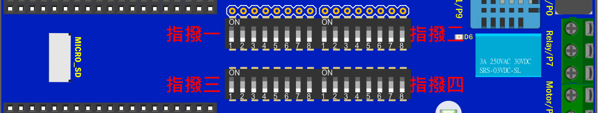

# KSB065 家控板

## 指撥開關腳位 對應表格

指撥開關往ON 的方向撥是 打開/ON，往下撥是 關閉/OFF

| 
指撥開關1 標示
 | 
感測器
 | 
micro:bit
 | 
PocketCard
 |
| --------------------------------------------- | ------------------------------------- | ---------------------------------------- | ----------------------------------------- |
| 1                                             | 蜂鳴器                                | P0                                       | IO26                                      |
| 2                                             | 滑桿                                  | P1                                       | IO33                                      |
| 3                                             | UART 插座Rx                           | P2                                       | IO32                                      |
| 4                                             | UART 插座Tx                           | P12                                      | IO15                                      |
| 5                                             | ST7735彩屏(DC)                        | P8                                       | IO27                                      |
| 6                                             | ST7735彩屏(SCK) 和 SD(SCK)            | P13                                      | IO18                                      |
| 7                                             | ST7735彩屏(MOSI) 和 SD(MOSI)          | P15                                      | IO23                                      |
| 8                                             | ST7735彩屏(CS)                        | P16                                      | IO5                                       |

如果需要使用micro:bit 5x5 LED屏，需要關閉 對應感測器的功能，指撥開關2 全部往下撥到OFF，

| 
指撥開關2 標示
 | 
感測器 
 | 
micro:bit
 | 
 PocketCard
 |
| --------------------------------------------- | -------------------------------------- | ---------------------------------------- | ------------------------------------------ |
| 1                                             | 光度感測器                             | P4                                       | IO4                                        |
| 2                                             | 馬達控制                               | P1                                       | IO33                                       |
| 3                                             | 紅外接收元件                           | P3                                       | IO35                                       |
| 4                                             | 繼電器                                 | P7                                       | IO17                                       |
| 5                                             | DHT11                                  | P9                                       | IO13                                       |
| 6                                             | 全彩燈                                 | P10                                      | IO2                                        |
| 7                                             | 馬達控制                               | P6                                       | IO16                                       |
| 8                                             | SD(CS)                                 | P4                                       | IO4                                        |

指撥開關3和指撥開關4 是NodeMCU-32S 專用指撥開關，是用來連接 NodeMCU-32S 和感測器的腳位，

使用micro:bit 和PocketCard 不用理會。

| 
 指撥開關3 標示 
 | 
感測器
 | 
NodeMCU-32S  
 |
| ----------------------------------------------- | ------------------------------------- | -------------------------------------------- |
| 1                                               | 蜂鳴器                                | IO26                                         |
| 2                                               | 滑桿 或 馬達控制                      | IO33                                         |
| 3                                               | UART 插座Rx                           | IO32                                         |
| 4                                               | UART 插座Tx                           | IO15                                         |
| 5                                               | ST7735彩屏(DC)                        | IO27                                         |
| 6                                               | ST7735彩屏(SCK) 和 SD(SCK)            | IO18                                         |
| 7                                               | ST7735彩屏(MOSI) 和 SD(MOSI)          | IO23                                         |
| 8                                               | ST7735彩屏(CS)                        | IO5                                          |

| 
 指撥開關4 標示 
 | 
感測器
 | 
NodeMCU-32S  
 |
| ----------------------------------------------- | ------------------------------------- | -------------------------------------------- |
| 1                                               | SD(CS) 或 光度感測器                  | IO4                                          |
| 2                                               | SD(MISO) 或 超音波                    | IO19                                         |
| 3                                               | 紅外接收元件                          | IO35                                         |
| 4                                               | 繼電器                                | IO17                                         |
| 5                                               | DHT11                                 | IO13                                         |
| 6                                               | 全彩燈                                | IO2                                          |
| 7                                               | 馬達控制                              | IO16                                         |
| 8                                               | x                                     | x                                            |

**PS**

Motor(馬達控制)  和 Slide(滑桿)  的 IO腳位P1重複，功能2擇1

Motor(馬達控制)  和  PSRAM 的 IO腳位P6重複，功能2擇1

Relay(繼電器)   和 PSRAM 的 IO腳位P7重複，功能2擇1

Light(光度) 和 SD 的 IO腳位P4重複，功能2擇1

Sonar(超音波插座) 和 SD 的 IO腳位P14重複，功能2擇1