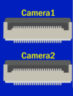

# KSB065 家控板

## Camera腳位 對應表格

PocketCard      使用Camera1

NodeMCU-32S 使用Camera2

| 腳位           | Camera1 (PocketCard) | Camera2(NodeMCU-32S) |
| -------------- | -------------------- | -------------------- |
| PWDN_GPIO_NUM  | -1                   | -1                   |
| RESET_GPIO_NUM | -1                   | -1                   |
| XCLK_GPIO_NUM  | 2                    | 0                    |
| SIOD_GPIO_NUM  | 18                   | 26                   |
| SIOC_GPIO_NUM  | 23                   | 25                   |
| Y9_GPIO_NUM    | 35                   | 2                    |
| Y8_GPIO_NUM    | 33                   | 33                   |
| Y7_GPIO_NUM    | 32                   | 32                   |
| Y6_GPIO_NUM    | 19                   | 36                   |
| Y5_GPIO_NUM    | 15                   | 15                   |
| Y4_GPIO_NUM    | 13                   | 13                   |
| Y3_GPIO_NUM    | 5                    | 34                   |
| Y2_GPIO_NUM    | 4                    | 35                   |
| HREF_GPIO_NUM  | 27                   | 39                   |
| VSYNC_GPIO_NUM | 14                   | 14                   |
| PCLK_GPIO_NUM  | 25                   | 12                   |

