# KSB065 家控板

## NodeMCU-32S ESP32 使用說明

------

若是還沒有安裝ESP32 的Arduino 開發環境，請參考PocketCard 的Arduino 安裝介紹

https://kaise-ksrobot.github.io/docs/ch/MCU/ESP/PocketCard/PocketCard_Arduino.html

再把KSB065 需要用的Lib （KSB065_ESP32_ARDUINO_DEMO/Lib）放置到Arduino libraries 的目錄

[KSB065_ESP32_ARDUINO_DEMO.zip](example/KSB065/KSB065_ESP32_ARDUINO_DEMO.zip)

PS 範例下載：選範例後再另存連結

#### 選擇 開發板和連接埠

點擊下拉功能表「Tools」>「Board」，

選擇「ESP32 Dev Module」

開發板設定值可以用預設，但「Partition Scheme」  請改選 「Huge APP」

PSRAM 選「Disabled」

 

## 基本範例

KSB065 配備很多感測器，所以有些感測器的使用IO腳位會跟其它感測器重複，因此要使用指撥開關來選定要使用的感測器且要關掉腳位重覆的感測器。

再練習基礎範例時，請先把 **攝像鏡頭和SD 卡拿掉**，

指撥1 和 指撥2 的開關全部都撥到ON

**指撥3 和 指撥4 的開關全部都撥到ON**(使用NodeMCU-32S 時，會用到這2個指撥)

 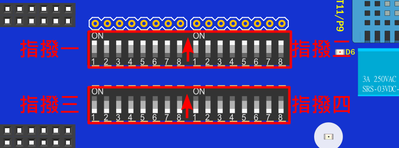

##### [指撥開關腳位 對應表格](KSB065_C2.md)

------

#### 範例1  蜂鳴器範例

1.蜂鳴器使用IO26

使用時，指撥1的開關1要打開

*指撥3 和 指撥4 的開關全部都撥到ON*

 

2.執行範例 EX01_Beep.ino

 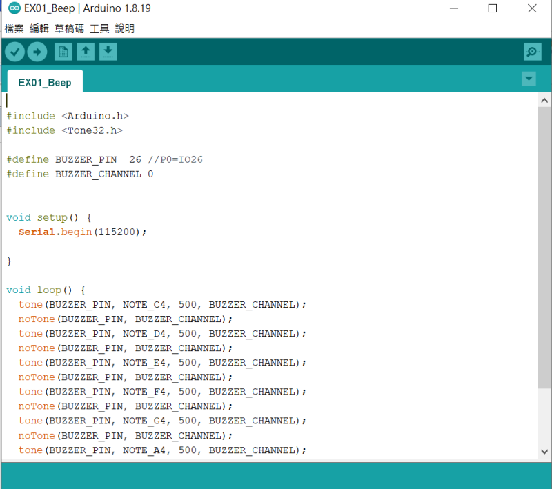

3.編譯下載完成，執行時蜂鳴器會有聲音

 

------

 #### 範例2  按鈕範例

1.

按扭A使用IO14

按扭B使用IO25

按鈕腳位跟指撥設定沒有關係

2.執行範例 EX02_Button.ino

 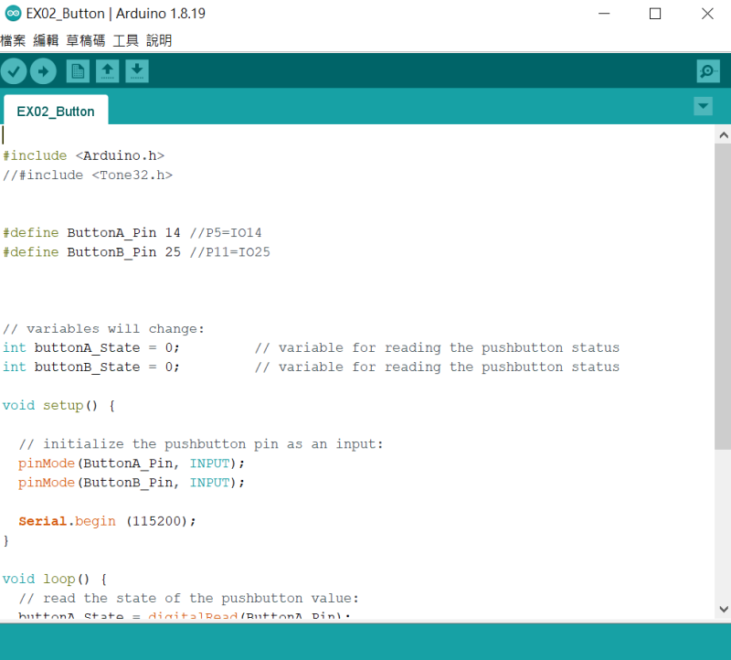

3.編譯下載完成，打開序列埠監看視窗， 按按鈕時視窗會出現該按鈕

 

------

 #### 範例3  滑桿範例

1.滑桿使用IO33

使用時，指撥1的開關2要打開

*指撥3 和 指撥4 的開關全部都撥到ON*

 

PS

Slide(滑桿)  和 Motor(馬達控制)  的 IO腳位P1/IO33重複，功能2擇1

2.執行範例 EX03_Slide.ino

 

3.編譯下載完成，打開序列埠監看視窗， 移動 滑桿 時視窗會出現數值

 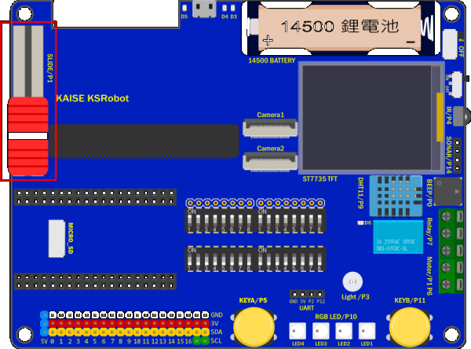

------

 #### 範例4  繼電器範例

1.繼電器使用IO17

使用時，指撥2的開關4要打開

*指撥3 和 指撥4 的開關全部都撥到ON*

 

PS

Relay(繼電器)   和 PSRAM 的 IO腳位P7/IO17重複，功能2擇1，所以使用繼電器時，**開發板選項中的PSRAM 要記得Disable**

2.執行範例 EX04_Relay.ino

 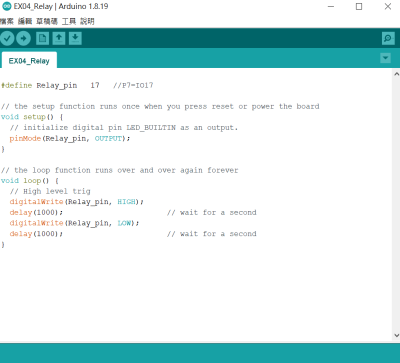

3.編譯下載完成，執行時會聽到繼電器切換開關的搭搭聲

 

------

 #### 範例5  亮度範例

1.亮度感測器使用IO4

使用時，指撥2的開關1要打開，**SD卡要拿掉** 或者 指撥2的開關8要關掉

*指撥3 和 指撥4 的開關全部都撥到ON*

 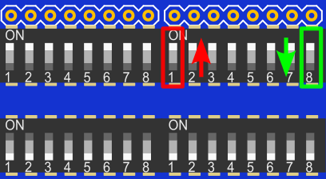

PS

Light(光度) 和 SD 的 IO腳位P4/IO4重複，功能2擇1

2.執行範例 EX05_Light.ino

 

3.編譯下載完成，打開序列埠監看視窗， 用手往亮度感測器移動時視窗會出現數值變化

 

------

 #### 範例6  DHT11溫濕度範例

1.DHT11使用IO13

使用時，指撥2的開關5要打開

*指撥3 和 指撥4 的開關全部都撥到ON*

 

2.執行範例 EX06_DHT11.ino

 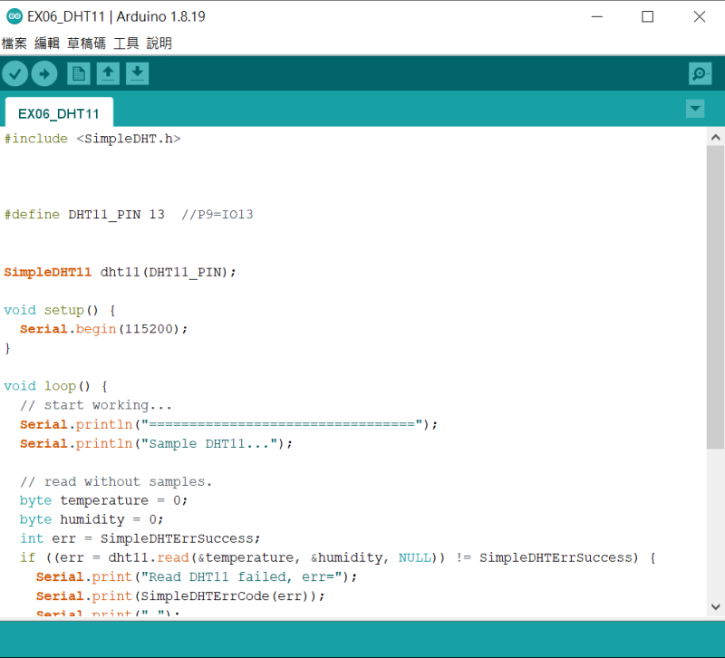

3.編譯下載完成，打開序列埠監看視窗， 視窗會出現溫度和濕度變化

 

------

 #### 範例7  全彩燈(WS2812B)範例

1.全彩燈(WS2812B)使用IO2

使用時，指撥2的開關6要打開

*指撥3 和 指撥4 的開關全部都撥到ON*

 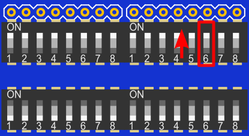

2.執行範例 EX07_RGB_LED.ino

 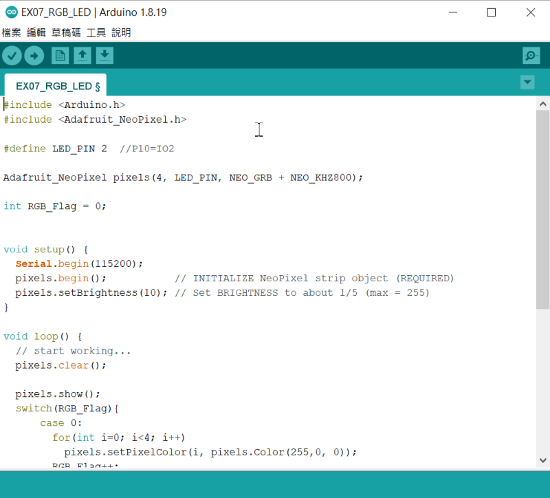

3.編譯下載完成，執行時4顆全彩燈(WS2812B)會依序亮 紅色 綠色 藍色

 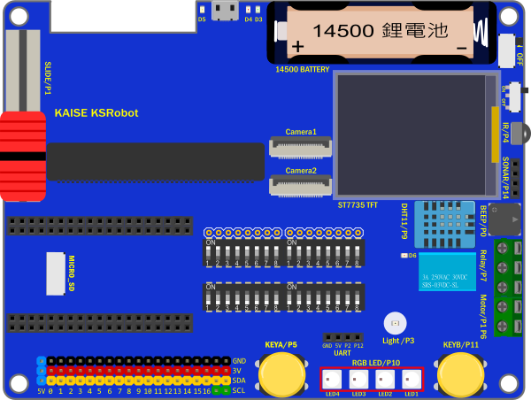

------

 #### 範例8  紅外遙控範例

1.紅外遙控接收元件使用IO35

使用時，指撥2的開關3要打開

*指撥3 和 指撥4 的開關全部都撥到ON*

 

2.執行範例 EX08_IR.ino

 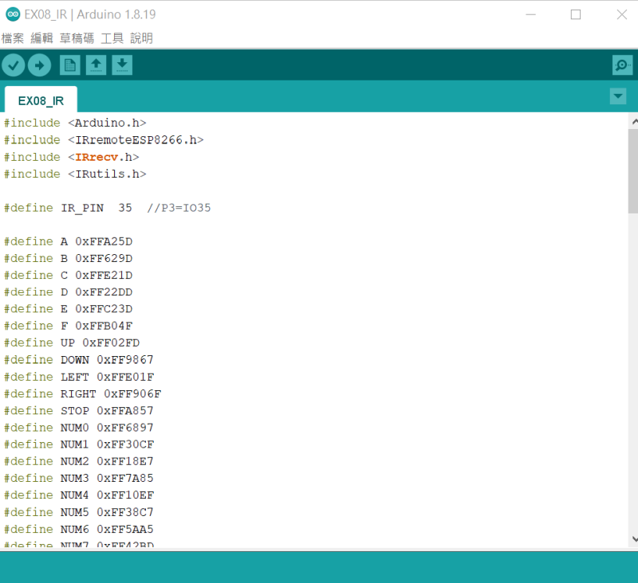

3.編譯下載完成，打開序列埠監看視窗， 按**KSRobot 21鍵 紅外遙控器** 的任意鍵，再視窗會出現該鍵的數值，使用一般遙控器也可以自行修改程式中的編碼值。

 

------

 #### 範例9  直流馬達控制範例

1.馬達控制

L9110S_1A 使用IO16

L9110S_1B 使用IO33

使用時，指撥1的開關2 要關掉，

指撥2的開關2 要打開，指撥2的開關7 要打開

*指撥3 和 指撥4 的開關全部都撥到ON*

 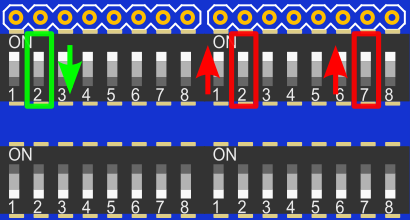

PS

Motor(馬達控制)  和 Slide(滑桿)  的 IO腳位P1/IO33重複，功能2擇1，所以使用馬達控制時滑桿要關掉

Motor(馬達控制)  和  PSRAM 的 IO腳位P6/IO16重複，功能2擇1，所以使用馬達控制時，**開發板選項中的PSRAM 要記得Disable**

2.執行範例 EX09_Motor.ino

 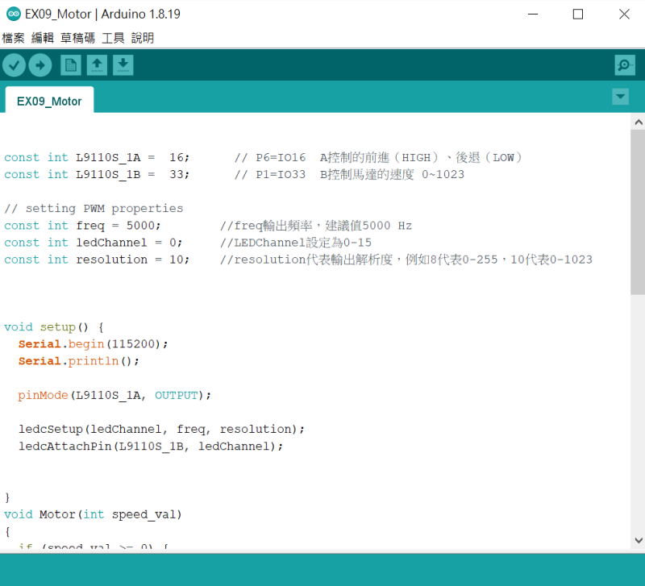

3.編譯下載完成，執行時馬達會正轉快轉，正轉慢轉，反轉快轉，反轉慢轉

 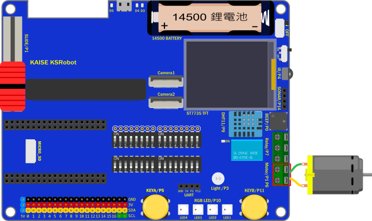

------

 #### 範例10  超音波範例

1.超音波使用IO19

使用時**SD卡要拿掉**，超音波腳位跟指撥設定沒有關係

PS

Sonar(超音波插座) 和 SD 的 IO腳位P14/IO19重複，功能2擇1

2.執行範例 EX10_Sonar.ino

 

3.編譯下載完成，打開序列埠監看視窗， 視窗會出現超音波的偵測距離

 

------

 #### 範例11  SD卡範例

1.SD卡使用IO4，IO18，IO19，IO23

使用時，**超音波要拿掉**，

指撥1的開關6要打開，指撥1的開關7要打開

指撥2的開關1要關掉，指撥2的開關8要打開

*指撥3 和 指撥4 的開關全部都撥到ON*

 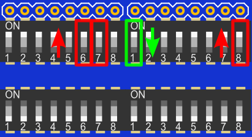

PS

SD 和 Light(光度) 和 的 IO腳位P4/IO4重複，功能2擇1

SD 和 Sonar(超音波插座)  的 IO腳位P14/IO19重複，功能2擇1

2.執行範例 EX11_SDCard.ino

 

3.編譯下載完成，打開序列埠監看視窗， 視窗會出現SD卡檔案目錄等資訊，若是沒有SD資訊，請按NodeMCU-32S的Reset 按鈕。

 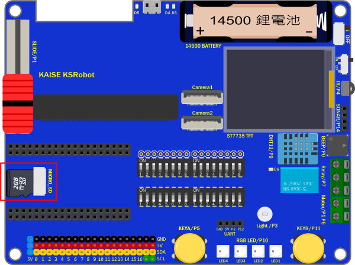

------

 #### 範例12  彩色螢幕範例

1.彩色螢幕使用IO5，IO18，IO23，IO27

使用時，

指撥1的開關5要打開，指撥1的開關6要打開

指撥1的開關7要打開，指撥1的開關8要打開

*指撥3 和 指撥4 的開關全部都撥到ON*

  

2.執行範例 EX12_TFTLCD.ino

 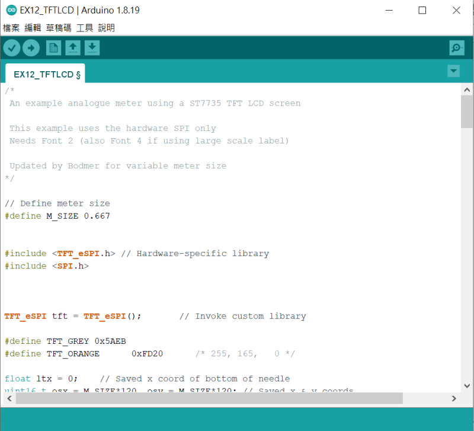

3.編譯下載完成，要記得打開TFT LCD的背光電源，執行時TFT LCD會有顯示儀表板的圖示

 

------

## 進階範例

------

 #### 範例13 秀SD的彩色圖片範例

1.範例中使用到TFT LCD 和SD 卡

SD卡使用IO4，IO18，IO19，IO23，

使用時，**超音波要拿掉**，

指撥1的開關6要打開，指撥1的開關7要打開

指撥2的開關1要關掉，指撥2的開關8要打開

彩色螢幕使用IO5，IO18，IO23，IO27，使用時，

指撥1的開關5要打開，指撥1的開關6要打開

指撥1的開關7要打開，指撥1的開關8要打開

*指撥3 和 指撥4 的開關全部都撥到ON*

 

2.執行範例 EX13_Show_SD_JPEG.ino

 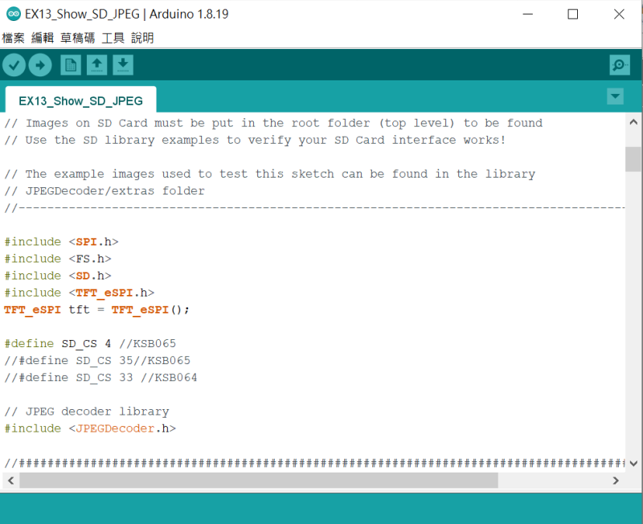

3.先準備好microSD卡，在根目錄放幾張160*120(128) 的圖片（範例目錄中有提供範例圖），編譯下載完成，要記得打開TFT LCD的背光電源，執行時TFT LCD會輪播顯示SD中的圖片，若是沒有影像，請按NodeMCU-32S的Reset 按鈕。

 

------

 #### 範例14  WEB Camera範例

#### 選擇 開發板和連接埠

點擊下拉功能表「Tools」>「Board」，

選擇「ESP32 Dev Module」

開發板設定值可以用預設，但「Partition Scheme」  請改選 「Huge APP」

PSRAM 選「Enabled」

 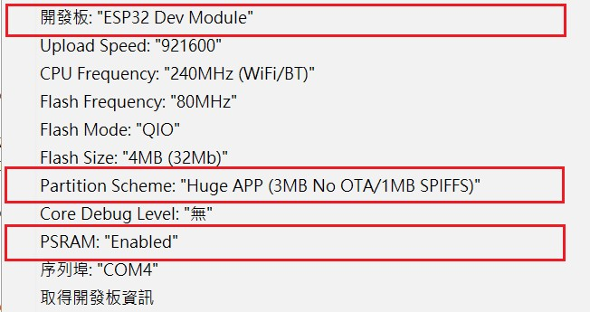

1.NodeMCU-32S 使用Camera 還可以同時使用 TFT LCD 和SD 卡，但其它感測器不能用。

指撥1的開關5 6 7 8要打開，指撥1其它腳位關掉

指撥2的開關8要打開，指撥2其它腳位關掉

指撥3的開關5 6 7 8要打開，指撥3其它腳位關掉

指撥4的開關1 2要打開，指撥4其它腳位關掉

 

2.執行範例 CameraWebServer_NodeMcu.ino

 

設定 你自己的AP 的SSID 和 Password，再下載執行

 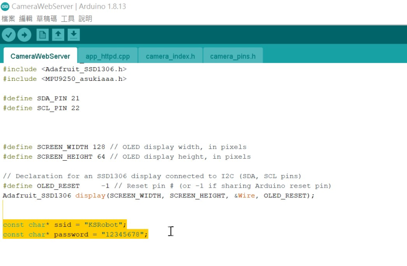

3.編譯下載完成，打開序列埠監看視窗，

 

鏡頭插在Camera2 若組裝和AP 設定沒有問題時，重新啟動成功時序列埠監看視窗會出現如下畫面，畫面中出現的IP 就是 Camera 的IP 位置

 

使用手機或筆電的瀏覽器輸入上面的IP 位置，會出現下面WEBCAM 的設定畫面

 

按下「Start Stream」就會出現攝影畫面

 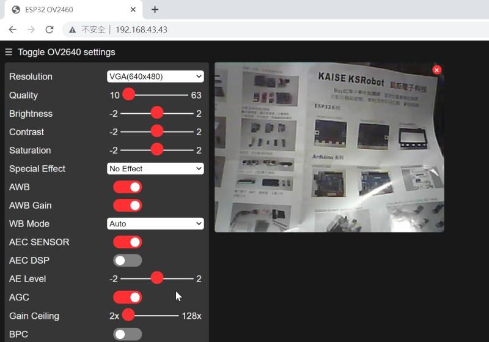