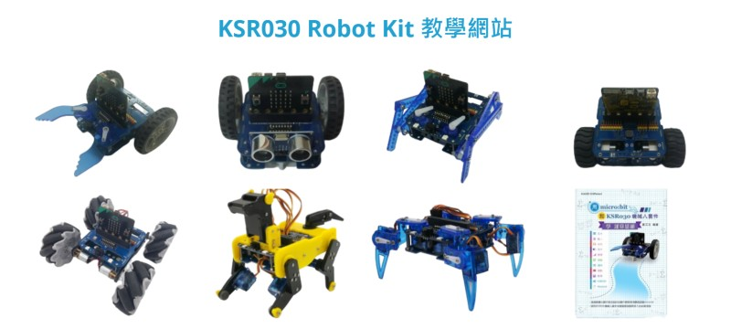

# KSR030 Version A N20馬達 自走車套件

請參考 [KSR030 Robot Kit 教學網站](http://ksr030.kaise.com.tw/) 中的

| **套件組裝** |   |   |   | 
| :--- | --- |--- |--- |
| [N20馬達小車 組裝](https://youtu.be/J6v7Vv4p2i4) | [硬體簡介手冊](http://ksr030.kaise.com.tw/manual/KSR030.pdf) |   |   | 

| **基礎練習**                                               |                                                           |                                                            |                                                            |
| :--------------------------------------------------------- | --------------------------------------------------------- | ---------------------------------------------------------- | ---------------------------------------------------------- |
| [積木安裝說明](http://ksr030.kaise.com.tw/docs/EX001.html) | [舵機校正](http://ksr030.kaise.com.tw/docs/EX001-1.html)  | [蜂鳴器練習](http://ksr030.kaise.com.tw/docs/EX002.html)   | [超音波測距](http://ksr030.kaise.com.tw/docs/EX003.html)   |
| [循跡使用練習](http://ksr030.kaise.com.tw/docs/EX004.html) | [全彩LED練習](http://ksr030.kaise.com.tw/docs/EX005.html) | [紅外遙控練習](http://ksr030.kaise.com.tw/docs/EX006.html) | [直流馬達練習](http://ksr030.kaise.com.tw/docs/EX007.html) |
| [舵機練習](http://ksr030.kaise.com.tw/docs/EX008.html)     | [問與答](http://ksr030.kaise.com.tw/docs/EX-QA.html)      |                                                            |                                                            |
| **小車控制應用**                                           |                                                           |                                                            |                                                            |
| [紅外遙控小車](http://ksr030.kaise.com.tw/docs/EX101.html) | [循跡自走車](http://ksr030.kaise.com.tw/docs/EX102.html)  | [避障自走車](http://ksr030.kaise.com.tw/docs/EX103.html)   | [追光自走車](http://ksr030.kaise.com.tw/docs/EX104.html)   |
| [RF 遙控小車](http://ksr030.kaise.com.tw/docs/EX105.html)  |                                                           |                                                            |                                                            |

