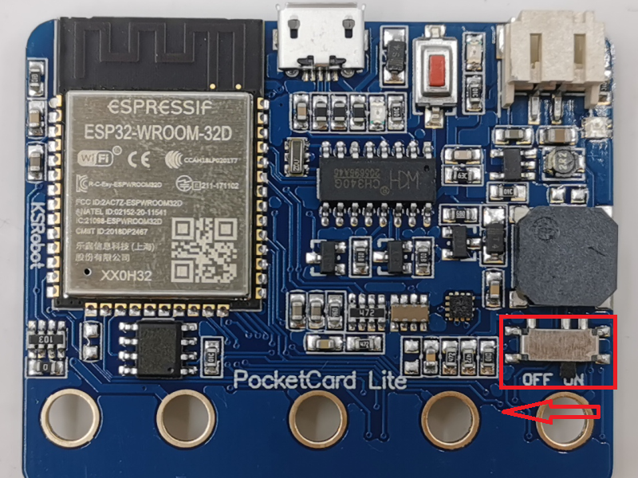
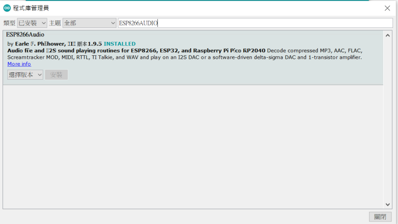
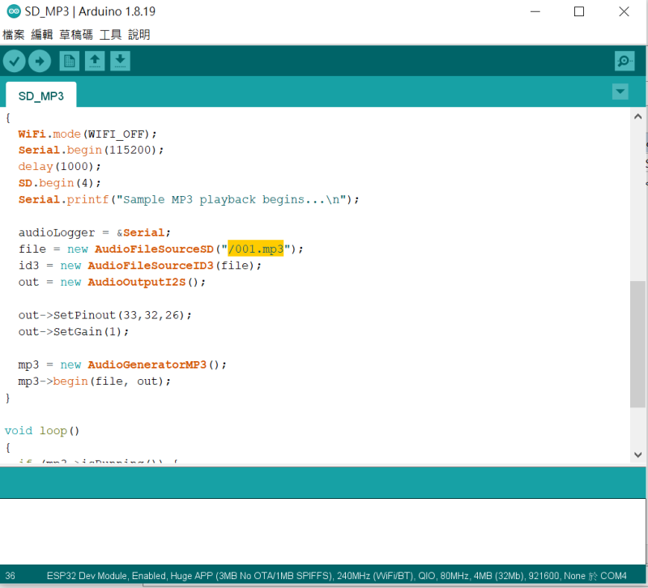
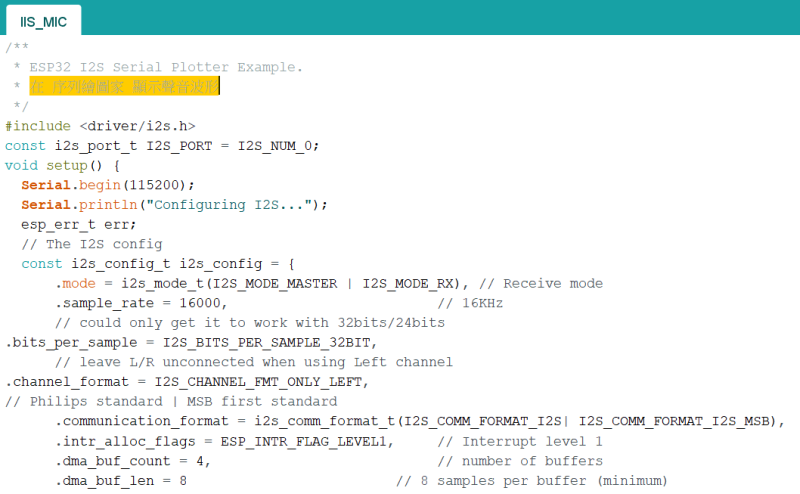
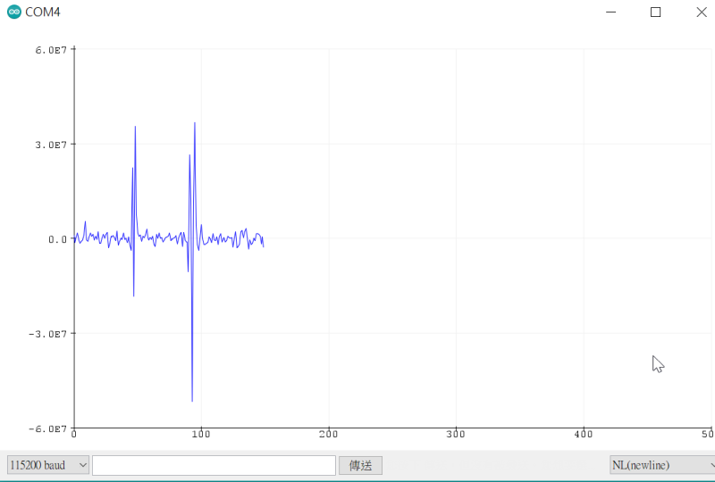

# PocketCard Audio Extension Board

#### PocketCard 音訊板

組裝後請把 PocketCard蜂鳴器開關關掉

#### 1. 主板版本確認

所有PocketCard 版本都可以使用

#### 2. 產品規格

| KSB063 Audio Extension Board |           |
| ---------------------------- | --------- |
| micro SD                     | x1        |
| 3.5 mm 耳機插座              | x1        |
| 高音量迷你揚聲器             | x1        |
| IIS 麥克風                   | x1        |
| IIS 音頻放大器               | MAX98357A |
| Size                         | 5.8x5.8cm |

#### 3. 感測器IO 對應表格

| Sensor 感測器 | PocketCard  |ESP32 IO |
| ----------------- | -------- | -------- |
| MAX98357A(BCLK)  	| P1    | IO33     |
| MAX98357A(LRC) 	| P2    | IO32     |
| MAX98357A(DIN) 	| P0    | IO26     |
| MIC(SCK)  		| P10  | IO2      |
| MIC(WS)   		| P9    | IO13     |
| MIC(SDO)  		| P12   | IO15     |
| SD(SCK)           | P13   | IO18     |
| SD(MOSI)          | P15  | IO23     |
| SD(MISO)          | P14  | IO19     |
| SD(CS)            | P4    | IO4      |

#### 4. 組裝

先按照 組裝影片 組裝好導電膠條，導電膠條如果有灰塵髒污等東西，請先用酒精清潔後再組裝。

<iframe width="560" height="315" src="https://www.youtube.com/embed/6ne-c_xRvqA" title="YouTube video player" frameborder="0" allow="accelerometer; autoplay; clipboard-write; encrypted-media; gyroscope; picture-in-picture" allowfullscreen></iframe>

接下來請把PocketCard 的蜂鳴器腳位 撥到 OFF 關閉

#### 5. 匯入 Libraries

點擊下拉功能表「草稿碼」>「匯入程式庫」> 「管理程式庫」
尋找加入 ESP8266Audio 這個LIB

#### 6. 執行 Demo Code

範例下載：選範例後再另存連結

##### 6-1 執行範例的 「[SD_MP3](example/audio/SD_MP3.zip)」

準備一張microSD卡，在根目錄上放一首 “001.mp3”，插到擴展板上的microSD 插座

下載範例，下載成功後會直接播放 001.mp3

##### 6-2 執行範例的 「[IIS_MIC](example/audio/IIS_MIC.zip)」

下載成功後，打開Arduino 的序列繪圖家 會在電腦螢幕中顯示聲音波形

在序列繪圖家 顯示聲音波形

#### 網路上 PocketCard 音訊擴展板 相關教學資料

劉正吉老師 相關積木教學

https://sites.google.com/jes.mlc.edu.tw/ljj/esp32/i2s%E9%BA%A5%E5%85%8B%E9%A2%A8%E7%A9%8D%E6%9C%A8

https://www.facebook.com/groups/1709303159292365/posts/3247873765435289/

#### 應用圖示

