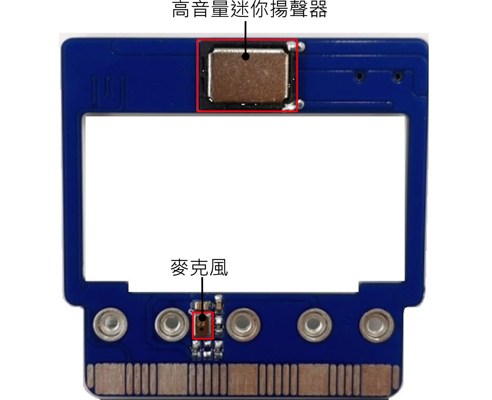
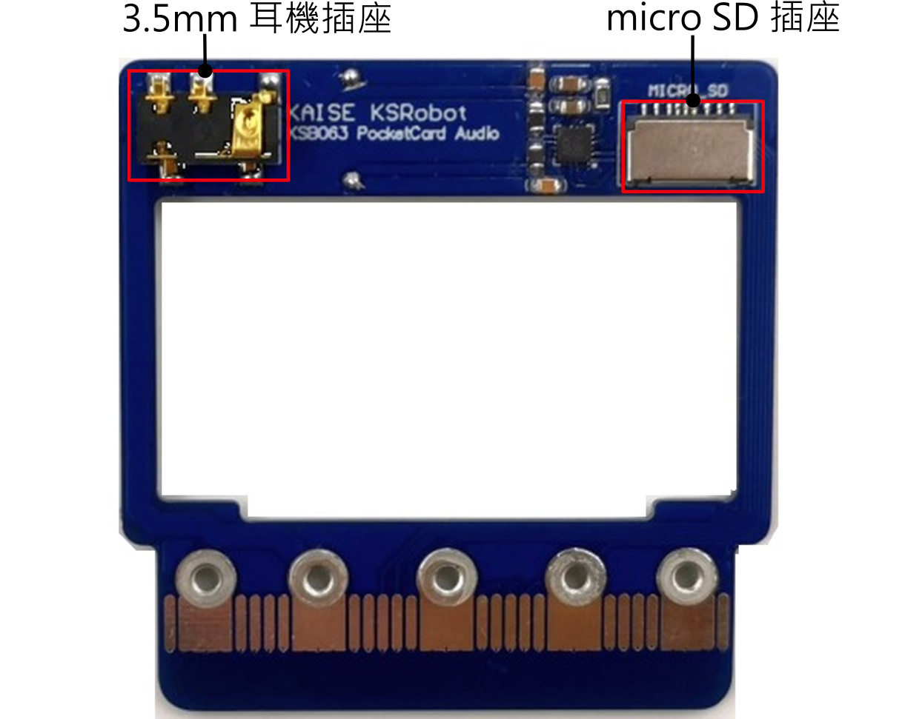
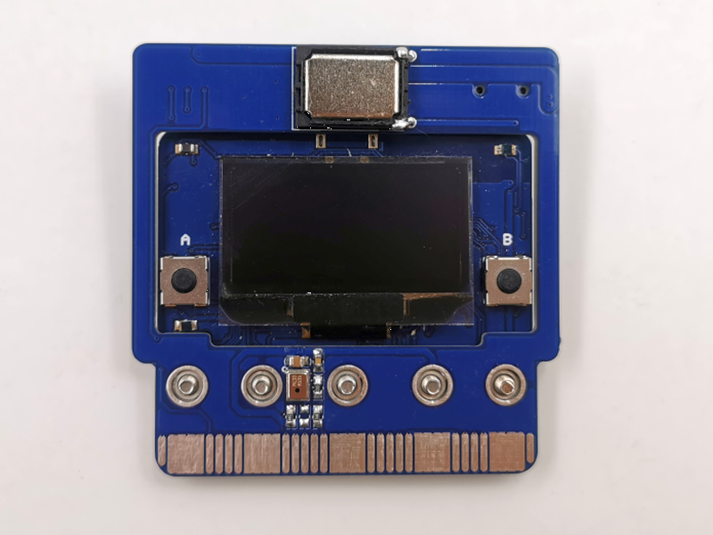
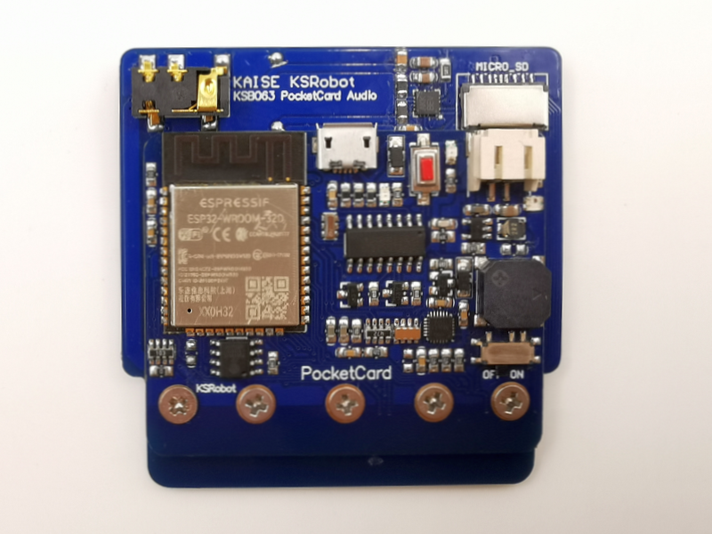
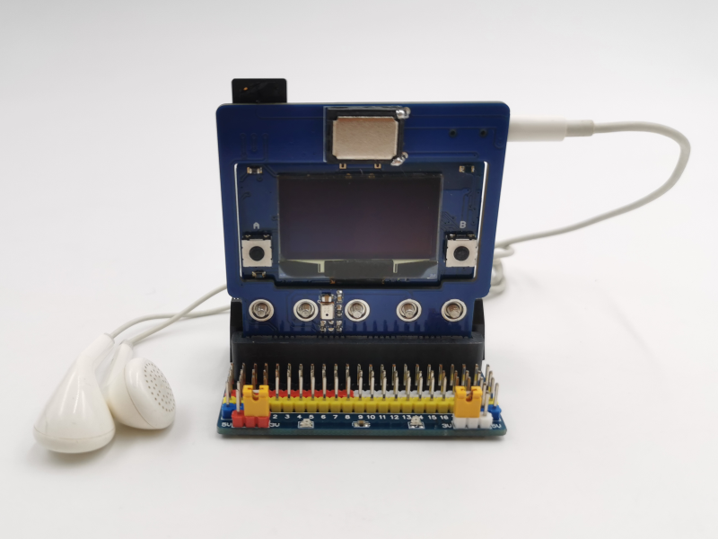
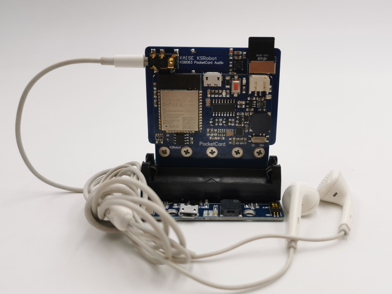

# PocketCard Audio Extension Board

#### PocketCard 音訊板

組裝後

#### 1. 主板版本確認

所有PocketCard 版本都可以使用

#### 2. 產品規格

| KSB063 Audio Extension Board |           |
| ---------------------------- | --------- |
| micro SD                     | x1        |
| 3.5 mm 耳機插座              | x1        |
| 高音量迷你揚聲器             | x1        |
| IIS 麥克風                   | x1        |
| IIS 音頻放大器               | MAX98357A |
| Size                         | 5.8x5.8cm |

#### 3. 感測器IO 對應表格

| Sensor 感測器 | ESP32 IO |
| ----------------- | -------- |
| MAX98357A(BCLK)  	| IO33     |
| MAX98357A(LRC) 	| IO32     |
| MAX98357A(DIN) 	| IO26     |
| MIC(SCK)  		| IO2      |
| MIC(WS)   		| IO13     |
| MIC(SDO)  		| IO15     |
| SD(SCK)           | IO18     |
| SD(MOSI)          | IO23     |
| SD(MISO)          | IO19     |
| SD(CS)            | IO4      |

#### 4. 組裝

先按照 組裝影片 組裝好導電膠條，導電膠條如果有灰塵髒污等東西，請先用酒精清潔後再組裝。

<iframe width="560" height="315" src="https://www.youtube.com/embed/6ne-c_xRvqA" title="YouTube video player" frameborder="0" allow="accelerometer; autoplay; clipboard-write; encrypted-media; gyroscope; picture-in-picture" allowfullscreen></iframe>

#### 5. 匯入 Libraries

#### 6. 執行 Demo Code

#### 應用圖示

