#### 1. 先下載Arduino IDE工具： 

  請至 https://www.arduino.cc/en/Main/Software 網站下載

#### 2. 安裝USB to UART 驅動程式

  請至http://www.wch.cn/download/CH341SER_ZIP.html

  安裝完驅動程式插入PocketCard，在裝置管理員中會出現新的COM 埠

  

#### 3. 安裝ESP32核心檔案

  啟動 Arduino IDE 並點擊下拉功能表「File」>「Preferences」。

  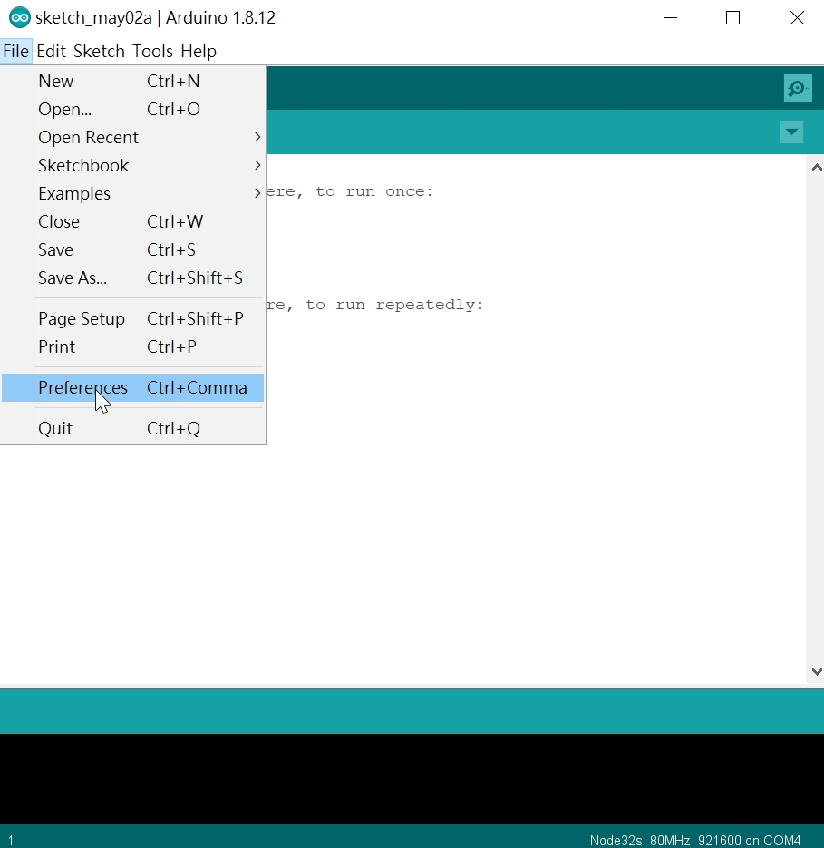

  Additional Boards Manager URLs：

  輸入 https://dl.espressif.com/dl/package_esp32_index.json

  然後點擊「OK」鈕。

  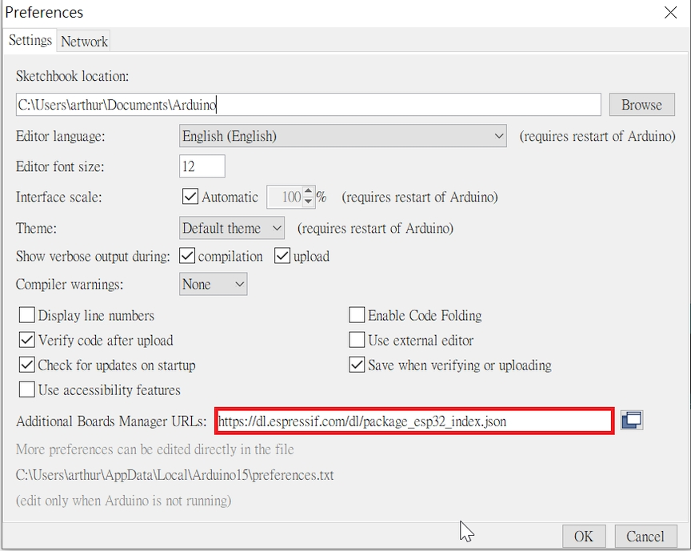

  點擊下拉功能表「Tools」>「Board」>

  「Board Manager...」

  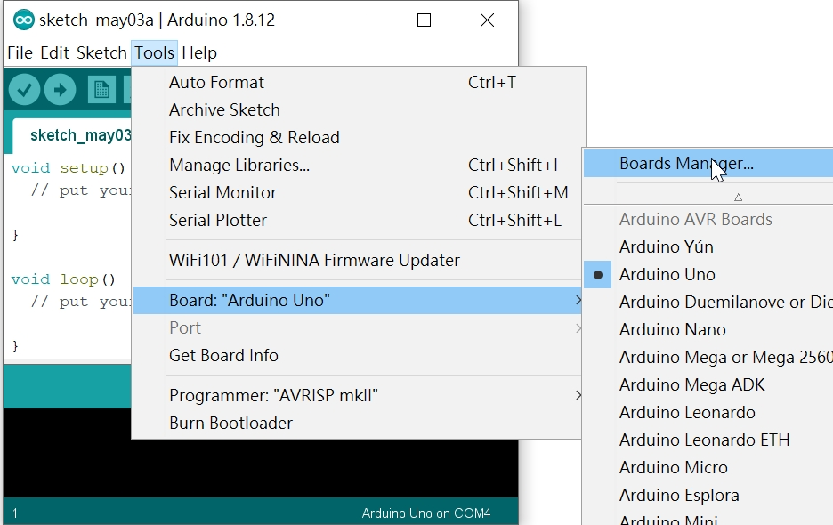

  在 Type 右方空白欄位輸入「esp32」

  點擊「Install」，然後等待幾分鐘下載完畢後點擊右下角落的「Close」鈕關閉視窗。 

  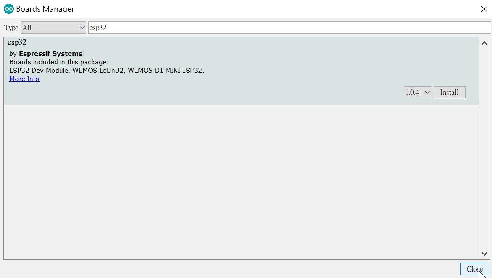

#### 4. 複製 Libraries

  請至https://github.com/kaise-ksrobot/pocketcard_arduino_demo

  點選Download ZIP 下載檔案

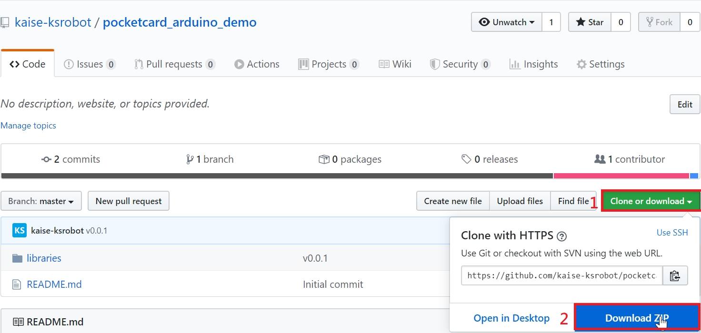

  解壓後把 pocketcard_arduino_demo/libraries 目錄中的檔案Copy 到 Arduino IDE/libraries

  Arduino IDE/libraries 目錄中會多出5個目錄

  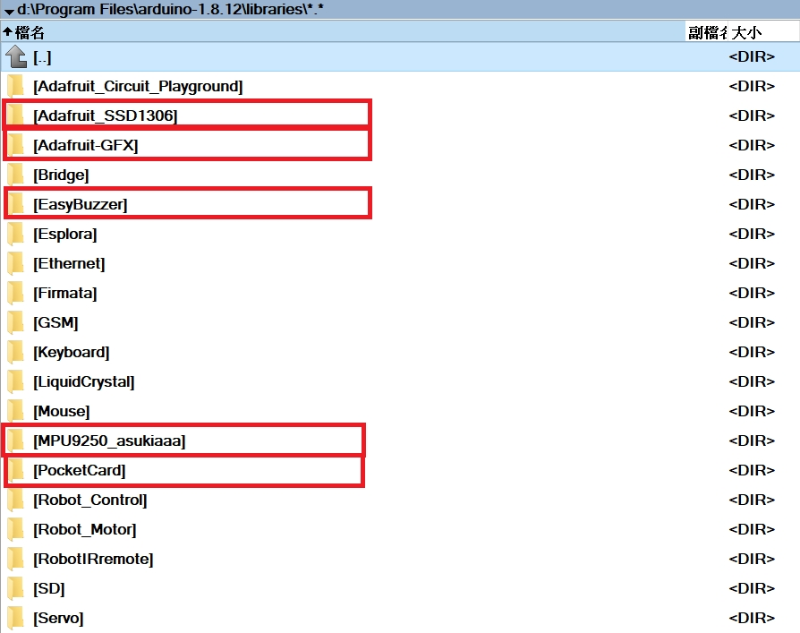

#### 5. 選擇 開發板和連接埠

  點擊下拉功能表「Tools」>「Board」，

  選擇「NodeMCU-32s」

  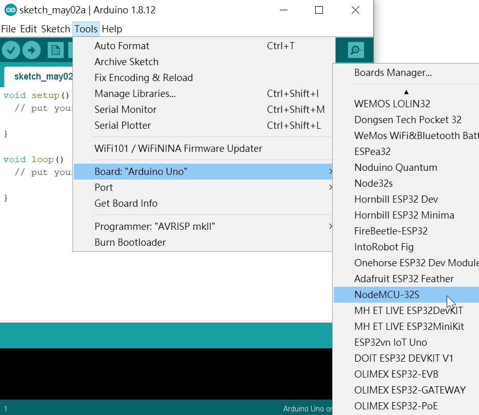

  然後再選擇連接埠

  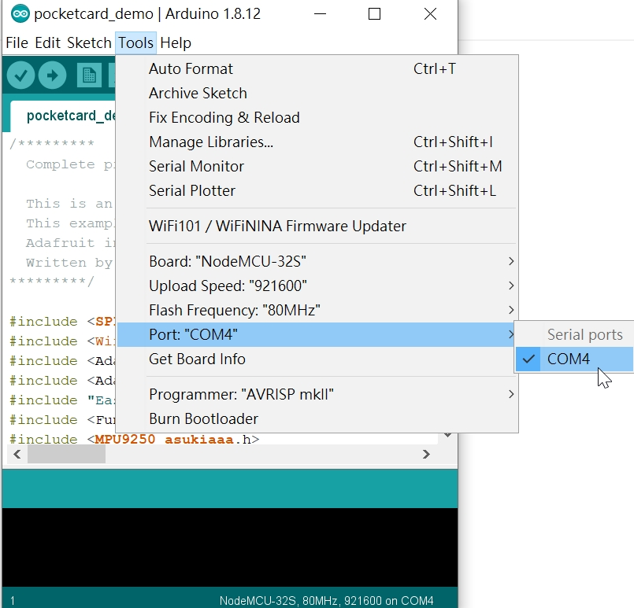

#### 6. 執行 Demo Code

  打開Arduino IDE/libraries/PocketCard/examples/pocketcard_demo/pocketcard_demo.ino

  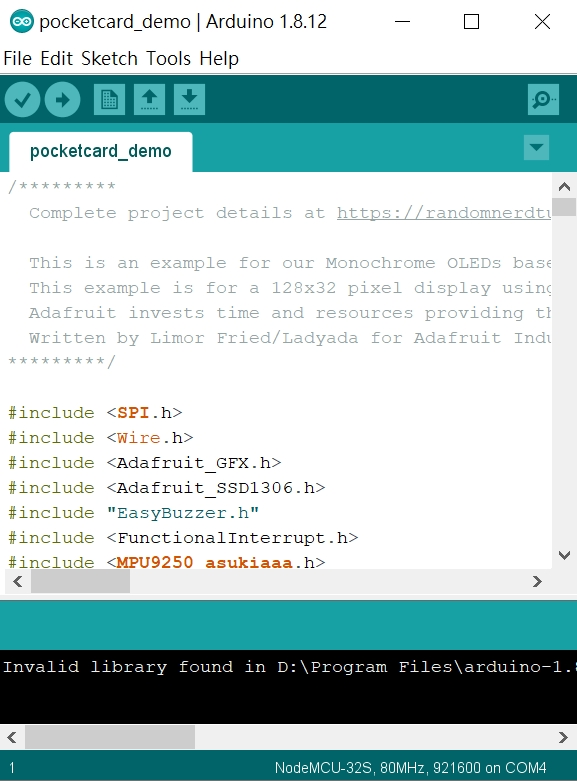

  下載成功後，會聽到蜂鳴器響一聲，Oled 面板會出現 “Hello, world” 再滅掉

  按A鍵 會出現Light Sensor(A) 和Light Sensor(B ) 和Temperature Sensor 的數值

  按B鍵 會出現MPU9250的偵測數值。

  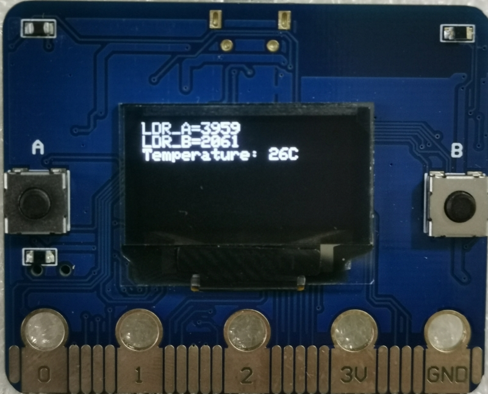

  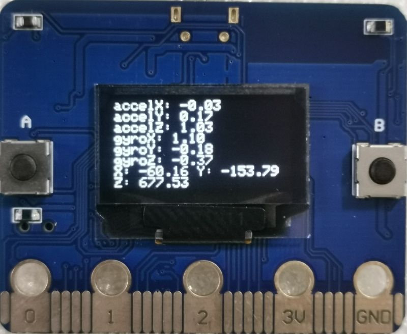